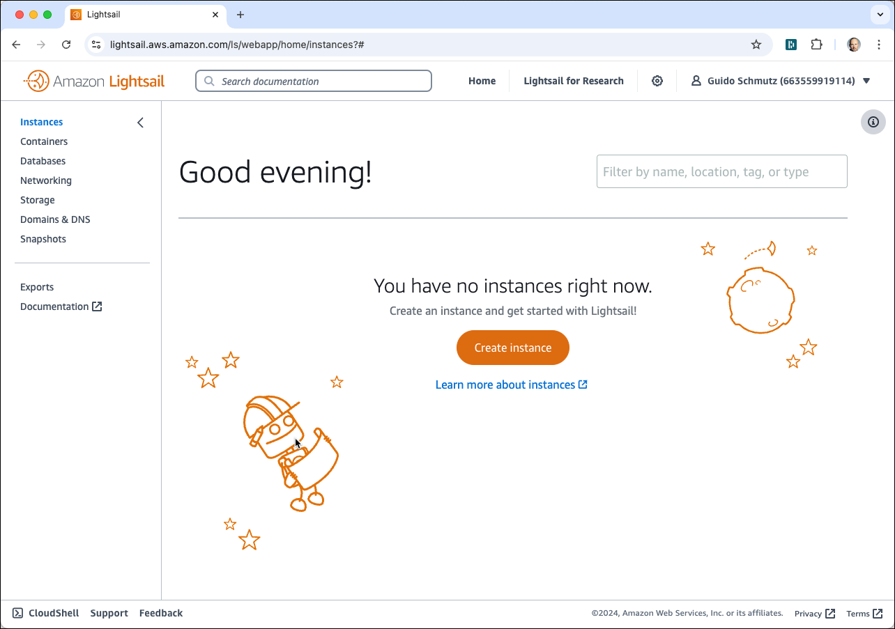

# AWS Lightsail

Navigate to the [AWS Console](http://console.aws.amazon.com) and login with your user. Click on the [Lightsail service](https://lightsail.aws.amazon.com/ls/webapp/home/instances).



## Provision instance

Click **Create instance** to navigate to the **Create an instance** dialog. 


Optionally change the **Instance Location** to a AWS region of your liking.
Keep **Linux/Unix** for the **Select a platform** and click on **OS Only** and select **Ubuntu 22.04 LTS** for the **Select a blueprint**.


Scroll down to **Launch script** and add the following script.

Optionally change the password from the default value of `ubuntu` to a more secure one. 

```bash
export GITHUB_PROJECT=iot-vehicle-tracking-demo
export GITHUB_OWNER=gschmutz
export DATAPLATFORM_HOME=docker
export PLATYS_VERSION=2.4.0
export NETWORK_NAME=ens5
export USERNAME=ubuntu
export PASSWORD=abc123!

# Prepare Environment Variables 
export PUBLIC_IP=$(curl ipinfo.io/ip)
export DOCKER_HOST_IP=$(ip addr show ${NETWORK_NAME} | grep "inet\b" | awk '{print $2}' | cut -d/ -f1)

# allow login by password
sudo sed -i "s/.*PasswordAuthentication.*/PasswordAuthentication yes/g" /etc/ssh/sshd_config
echo "${USERNAME}:${PASSWORD}"|chpasswd
sudo service sshd restart

# add alias "dataplatform" to /etc/hosts
echo "$DOCKER_HOST_IP     dataplatform" | sudo tee -a /etc/hosts

# Install Docker
sudo apt-get update
sudo apt-get install \
    ca-certificates \
    curl \
    gnupg \
    lsb-release
sudo mkdir -p /etc/apt/keyrings    
curl -fsSL https://download.docker.com/linux/ubuntu/gpg | sudo gpg --dearmor -o /etc/apt/keyrings/docker.gpg
echo \
  "deb [arch=$(dpkg --print-architecture) signed-by=/etc/apt/keyrings/docker.gpg] https://download.docker.com/linux/ubuntu \
  $(lsb_release -cs) stable" | sudo tee /etc/apt/sources.list.d/docker.list > /dev/null

sudo apt-get update
sudo apt-get install -y docker-ce docker-ce-cli containerd.io docker-compose-plugin
sudo usermod -aG docker $USERNAME

# Install Docker Compose Switch
sudo curl -fL https://github.com/docker/compose-switch/releases/latest/download/docker-compose-linux-amd64 -o /usr/local/bin/compose-switch
chmod +x /usr/local/bin/compose-switch
sudo update-alternatives --install /usr/local/bin/docker-compose docker-compose /usr/local/bin/compose-switch 99

# Install Platys
sudo curl -L "https://github.com/TrivadisPF/platys/releases/download/${PLATYS_VERSION}/platys_${PLATYS_VERSION}_linux_x86_64.tar.gz" -o /tmp/platys.tar.gz
tar zvxf /tmp/platys.tar.gz 
sudo mv platys /usr/local/bin/
sudo chown root:root /usr/local/bin/platys
sudo rm /tmp/platys.tar.gz 

# Install various Utilities
sudo apt-get install -y curl jq kafkacat tmux unzip

# needed for elasticsearch
sudo sysctl -w vm.max_map_count=262144 

# Get the project
cd /home/${USERNAME} 
git clone https://github.com/${GITHUB_OWNER}/${GITHUB_PROJECT}
chown -R ${USERNAME}:${USERNAME} ${GITHUB_PROJECT}

cd /home/${USERNAME}/${GITHUB_PROJECT}/${DATAPLATFORM_HOME}

# Make Environment Variables persistent
sudo echo "export PUBLIC_IP=$PUBLIC_IP" | sudo tee -a /etc/profile.d/platys-platform-env.sh
sudo echo "export DOCKER_HOST_IP=$DOCKER_HOST_IP" | sudo tee -a /etc/profile.d/platys-platform-env.sh
sudo echo "export DATAPLATFORM_HOME=$PWD" | sudo tee -a /etc/profile.d/platys-platform-env.sh
sudo echo "" | sudo tee -a sudo tee -a /etc/profile.d/platys-platform-env.sh
sudo echo "alias kcat=kafkacat" | sudo tee -a /etc/profile.d/platys-platform-env.sh

# Startup Environment
docker compose up -d
```

into the **Launch Script** edit field
 


Under **Choose your instance plan** click on the arrow on the right and select the **16 GB** instance.  

Under **Identify your instance** enter **IoT-Vehicle-Tracking** into the edit field.


Click on **Create Instance** to start provisioning the instance. 

The new instance will show up in the Instances list on the Lightsail homepage. 


Click on the instance to navigate to the image details page. On the right you can find the Public IP address of the newly created instance, which is **18.196.124.212** in this example, of course your Public IP will be different.


Click **Connect using SSH** to open the console and enter the following command to watch the log file of the init script.

```
tail -f /var/log/cloud-init-output.log --lines 1000
```

The initialisation is finished when you see the `Creating xxxxx .... done` lines after all the docker images have been downloaded, which takes a couple of minutes. 


## View Platform Documentation

The platform contains some web-based documentation, which can be accessed once the platform is running. In a web browser, navigate to the public IP <http://18.196.124.212> (replace the IP address by your Public IP address) and you should see a page similar to the one shown here


If you click on the "A list of available services is available here" a page with the list of available services and their IP address will appear


So with all services running, there is one last step to do. We have to configure the Firewall to allow traffic into the Lightsail instance.

## Open Network Firewall

For accessing the services running in the cloud from our machine, we have two options:

1. Open the ports on the firewall (this is what we do here)
2. Create an SSH Tunnel

Because the Lightsail instance is exposed to the public internet, generally opening the ports is not the best idea. But if you open it to accept only traffic from your own IP address, the risk can be minimised. Using an SSH tunnel is more secure, but also more difficult to setup.

So let see how we can open the ports on the firewall. Click on the **Networking** tab/link to navigate to the network settings.


Click on **Add rule** to add a new Firewall rule.

For simplicity reasons, we allow all TCP traffic by selecting **All TCP** on port range **0 - 65535**.
To increase security, you should restrict incoming traffic to one or more IP addresses by selecting the option **Restrict to IP address** and adding the IP address of your client as the **Source IP address**.


To find out your IP address, browse to <https://www.whatismyip.com/> and use the `XXX.XXX.XXX.XXX` value shown right to **My Public IPv4 is:** to replace the `188.60.35.196` value in the image above.

Click on **Create** to save this new Firewall rule and it should be added to the list of rules.


Your instance is now ready to use. Complete the post installation steps documented the [here](README.md).