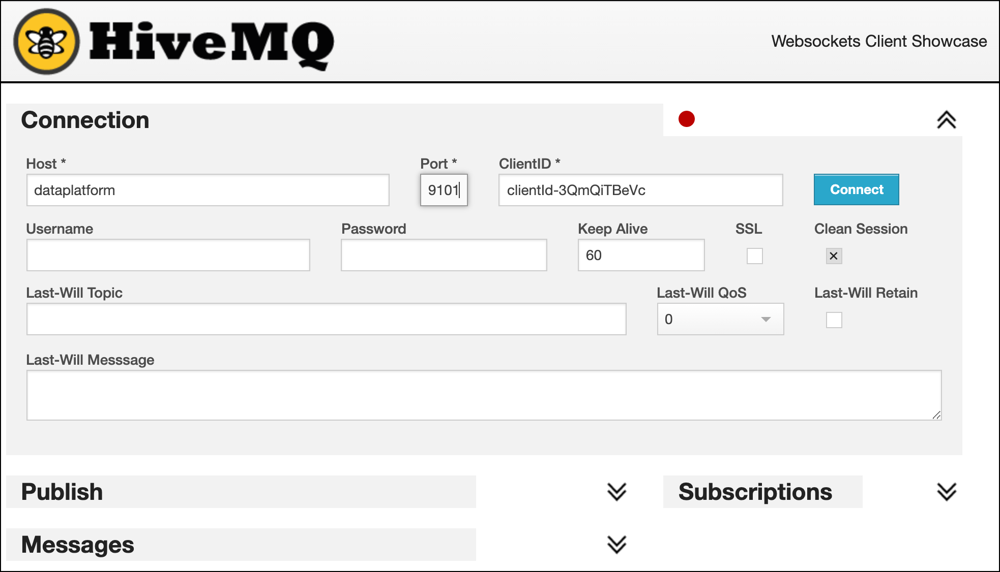

# IoT Vehicle Tvehicle_trackingracking Streaming Pipeline

This project shows how to setup and run the demo used in various talks, such as "Introduction into Stream Processing". 

## Preparation

The platform where the demos can be run on, has been generated using the [`platys`](http://github.com/trivadispf/platys)  toolset using the [`platys-modern-data-platform`](http://github.com/trivadispf/platys-modern-data-platform) stack.

The generated artefacts are available in the `./docker` folder.

The prerequisites for running the platform are 
 
 * Docker 
 * Docker Compose. 

The environment is completely based on docker containers. In order to easily start the multiple containers, we are going to use Docker Compose. You need to have at least 8 GB of RAM available, better is 12 GB or 16 GB.

### Start the platform using Docker Compose

First, create the following two environment variables, which export the Public IP address (if a cloud environment) and the Docker Engine (Docker Host)  IP address:

``` bash
export DOCKER_HOST_IP=<docker-host-ip>
export PUBLIC_IP=<public-host-ip>
```

You can either add them to `/etc/environment` (without export) to make them persistent or use an `.env` file inside the `docker` folder with the two variables.

It is very important that these two are set, otherwise the platform will not run properly.

Now navigate into the `docker` folder and start `docker-compose`.

``` bash
cd ./docker

docker-compose up -d
```

To show all logs of all containers use

``` bash
docker-compose logs -f
```

To show only the logs for some of the containers, for example `kafka-connect-1` and `kafka-connect-2`, use


``` bash
docker-compose logs -f kafka-connect-1 kafka-connect-2
```

Some services in the `docker-compose.yml` are optional and can be removed, if you don't have enough resources to start them. 

As a final step, add `dataplatform` as an alias to the `/etc/hosts` file so that the links used in this document work. 

```
<public-host-ip>		dataplatform
```

If you have no rights for doing that, then you have to use your IP address instead of `dataplatform` in all the URLs.  

### Available Services 

The following user interfaces are available:

 * Cluster Manager for Apache Kafka: <http://dataplatform:28104> 
 * Apache Kafka HQ: <http://dataplatform:28107>
 * Schema Registry UI: <http://dataplatform:28102>
 * Kafka Connect UI: <http://dataplatform:28103>
 * StreamSets Data Collector: <http://dataplatform:18630>
 * MQTT UI: <http://dataplatform:28136>
 * Cloudbeaver: <http://dataplatform:8978>

### Creating the necessary Kafka Topics

The Kafka cluster is configured with `auto.topic.create.enable` set to `false`. Therefore we first have to create all the necessary topics, using the `kafka-topics` command line utility of Apache Kafka. 

Using the `kafka-topics` CLI inside the `kafka-1` docker container to create the topics `vehicle_tracking_` and `logisticsdb_driver `.

``` bash
docker exec -it kafka-1 kafka-topics --zookeeper zookeeper-1:2181 --create --topic vehicle_tracking_sysA --partitions 8 --replication-factor 3
docker exec -it kafka-1 kafka-topics --zookeeper zookeeper-1:2181 --create --topic vehicle_tracking_sysB --partitions 8 --replication-factor 3
```

If you don't like to work with the CLI, you can also create the Kafka topics using the graphical user interfaces [Cluster Manager for Kafka (CMAK)](http://dataplatform:28104) or the [Apache Kafka HQ (AKHQ)](http://dataplatform:28107). 

### Setup logistics_db Postgresql Database

The necessary tables are created automatically when running the stack using Docker Compose. Use the following command in a terminal window, to show the content of the `driver` table:

``` bash
docker exec -ti postgresql psql -d demodb -U demo -c "SELECT * FROM logistics_db.driver"
``` 

### Simulating Vehicle Tracking Data

For simulating vehicle tracking data, we are going to use a Java program (adapted from Hortonworks) and maintained [here](https://github.com/TrivadisBDS/various-bigdata-prototypes/tree/master/streaming-sources/iot-truck-simulator/impl).

The simulator can produce data to various targets, such as **Kafka**, **MQTT** or **Files**. These two options are shown below. 
	
Now let's produce the truck events to the MQTT broker running on port 1883. In a terminal window run the following command:

``` bash
docker run trivadis/iot-truck-simulator '-s' 'MQTT' '-h' $DOCKER_HOST_IP '-p' '1883' '-f' 'JSON' '-vf' '1-49'
```

Leave this running in the terminal window. 

## Demo 1 - Consume Vehicle Tracking messages from MQTT and send to Kafka

In this part we will show how we can consume the data from the MQTT broker and send it to a Kafka topic. We will be using *Kafka Connect* for that. 

### Check message in MQTT

Let's first see that we get vehicle tracking messages in the topic MQTT topic hierarchy `trucks/+/position`. 

There two options for consuming from MQTT
 
 * use dockerized MQTT client in the terminal
 * use browser-based HiveMQ Web UI

#### Using Dockerized MQTT Client

To start consuming using through a command line, perform the following docker command:

``` bash
docker run -it --rm efrecon/mqtt-client sub -h $DOCKER_HOST_IP -t "truck/+/position" -v
```

The consumed messages will show up in the terminal.

#### Using HiveMQ Web UI  

To start consuming using the MQTT UI ([HiveMQ Web UI](https://www.hivemq.com/docs/3.4/web-ui/introduction.html)), navigate to <http://dataplatform:28136> and connect using `dataplatform` for the **Host** field, `9001` for the **Port** field and then click on **Connect**: 


	
When successfully connected, click on Add New Topic Subscription and enter `truck/+/position` into **Topic** field and click **Subscribe**:
	


As soon as messages are produced to MQTT, you should see them either on the CLI or in the MQTT UI (Hive MQ) as shown below.


Alternatively you can also use the [MQTT.fx](https://mqttfx.jensd.de/) or the [MQTT Explorer](https://mqtt-explorer.com/) applications to browse for the messages on the MQTT broker. They are both available for installation on Mac or Windows. 

### Setup Kafka Connect to bridge between MQTT and Kafka

In order to get the messages from MQTT into Kafka, we will be using Kafka Connect. 

There are multiple Kafka Connectors available for MQTT. We can either use the one provided by [Confluent Inc.](https://www.confluent.io/connector/kafka-connect-mqtt/) (in preview and available as evaluation license on Confluent Hub) or the one provided as part of the [Landoop Stream-Reactor Project](https://github.com/Landoop/stream-reactor/tree/master/kafka-connect-mqtt) available on GitHub. Here we will use the one provided by Confluent. Just be aware that is part of Confluent Enterprise, but available for evaluation. 

The Confluent MQTT Connector was downloaded when running the Compose stack. You can check that the connector is installed by calling the REST API of the Kafka Connector cluster:

```bash
curl -XGET http://dataplatform:8083/connector-plugins | jq
```

Before we start the connector, let's use a Kafka console listener to consume from the target topic `vehicle_tracking_sysA`. We can use the `kafkacat` utility, which you can either install locally or use the one provided with the Compose stack: 

```bash
docker exec -ti kafkacat kafkacat -b kafka-1 -t vehicle_tracking_sysA -f "%k - %s\n"
```

Now let's start the connector:

```bash
curl -X "POST" "$DOCKER_HOST_IP:8083/connectors" \
     -H "Content-Type: application/json" \
     --data '{
  "name": "mqtt-vehicle-position-source",
  "config": {
    "connector.class": "io.confluent.connect.mqtt.MqttSourceConnector",
    "tasks.max": "1",
    "mqtt.server.uri": "tcp://mosquitto-1:1883",
    "mqtt.topics": "truck/+/position",
    "mqtt.clean.session.enabled":"true",
    "mqtt.connect.timeout.seconds":"30",
    "mqtt.keepalive.interval.seconds":"60",
    "mqtt.qos":"0",
    "kafka.topic":"vehicle_tracking_sysA",
    "confluent.topic.bootstrap.servers": "kafka-1:19092,kafka-2:19093",
    "confluent.topic.replication.factor": "3",
    "key.converter": "org.apache.kafka.connect.storage.StringConverter",
    "value.converter": "org.apache.kafka.connect.converters.ByteArrayConverter"
    }
  }'
```

The truck position messages are sent to the `vehicle_tracking_sysA` topic and should show up on the kafkacat consumer immediately. 

To stop the connector, you can again use the REST API:

```bash
curl -X "DELETE" "$DOCKER_HOST_IP:8083/connectors/mqtt-vehicle-position-source"
```

### Monitor connector in Kafka Connect UI

Navigate to the [Kafka Connect UI](http://dataplatform:28001) to view the connector in a graphical window.

## Demo 2 - Using KSQL to Refine the data

### Connect to ksqlDB engine

Let's connect to the ksqlDB shell

``` bash
docker exec -it ksqldb-cli ksql http://ksqldb-server-1:8088
```

### Use ksqlDB for displaying messages

Show the available Kafka topics

```sql
show topics;
```

Let's consume the data from the `truck_position` topic, assuming the truck simulator and the MQTT connector is still running.

```sql
print 'vehicle_tracking_sysA';
```

You can also add the keyword `from beginning` to start consuming at the beginning of the topic.

```sql
print 'vehicle_tracking_sysA' from beginning;
```

You can also use the show commands for showing the other KSQL objects (which we will now create)

```sql
show streams;
show tables;
show queries;
```

### Create a Stream and SELECT from it

First drop the stream if it already exists:

``` sql
DROP STREAM IF EXISTS vehicle_tracking_sysA_s;
```

Now let's create the ksqlDB Stream

``` sql
CREATE STREAM IF NOT EXISTS vehicle_tracking_sysA_s 
  (mqttTopic VARCHAR KEY,
  timestamp VARCHAR, 
   truckId VARCHAR, 
   driverId BIGINT, 
   routeId BIGINT,
   eventType VARCHAR,
   latitude DOUBLE,
   longitude DOUBLE,
   correlationId VARCHAR)
  WITH (kafka_topic='vehicle_tracking_sysA',
        value_format='JSON');
```

We are using the `JSON` value format, as our stream is a JSON-formatted string. 

Let's see the live data by using a `SELECT` on the Stream with the `EMIT CHANGES` clause:

``` sql
SELECT * FROM vehicle_tracking_sysA_s EMIT CHANGES;
```

You should see a continuous stream of events as a result of the SELECT statement, similar as shown below:

```
ksql> SELECT * from vehicle_tracking_sysA_s EMIT CHANGES;
+------------------------------+------------------------------+------------------------------+------------------------------+------------------------------+------------------------------+------------------------------+------------------------------+------------------------------+
|MQTTTOPIC                     |TIMESTAMP                     |TRUCKID                       |DRIVERID                      |ROUTEID                       |EVENTTYPE                     |LATITUDE                      |LONGITUDE                     |CORRELATIONID                 |
+------------------------------+------------------------------+------------------------------+------------------------------+------------------------------+------------------------------+------------------------------+------------------------------+------------------------------+
|truck/11/position             |1599398981285                 |11                            |17                            |1594289134                    |Normal                        |38.99                         |-93.45                        |-8240058917944842967          |
|truck/42/position             |1599398981846                 |42                            |22                            |1325562373                    |Normal                        |37.15                         |-97.32                        |-8240058917944842967          |
|truck/10/position             |1599398982135                 |10                            |10                            |1962261785                    |Normal                        |38.09                         |-91.44                        |-8240058917944842967          |
|truck/34/position             |1599398982454                 |34                            |16                            |1198242881                    |Normal                        |39.01                         |-93.85                        |-8240058917944842967          |
```

We have submitted our first simple KSQL statement. Let's now add some analytics to this base statement. 


Get info on the stream using the `DESCRIBE` command

```sql
DESCRIBE vehicle_tracking_sysA_s;
DESCRIBE EXTENDED vehicle_tracking_sysA_s;
```

### Create th new "refined" stream where the data is transformed into Avro

First drop the stream if it already exists:

``` sql
DROP STREAM IF EXISTS vehicle_tracking_refined_s;
```

And now create the refined ksqlDB Stream:

``` sql
CREATE STREAM IF NOT EXISTS vehicle_tracking_refined_s 
  WITH (kafka_topic='vehicle_tracking_refined',
        value_format='AVRO',
        VALUE_AVRO_SCHEMA_FULL_NAME='com.trivadis.avro.VehicleTrackingRefined')
AS SELECT truckId AS ROWKEY
		, 'Tracking_SysA' AS source
		, timestamp
		, AS_VALUE(truckId) AS vehicleId
		, driverId
		, routeId
		, eventType
		, latitude
		, longitude
		, correlationId
FROM vehicle_tracking_sysA_s
PARTITION BY truckId
EMIT CHANGES;
```

to check that the refined topic does in fact hold avro formatted data, let's just do a normal kafkacat on the `truck_position_refined` topic

``` bash
docker exec -ti kafkacat kafkacat -b kafka-1 -t vehicle_tracking_refined
```

we can see that it is serialized as Avro 

```
                            Normal���Q�B@ףp=
WX�$343671958179690963
1598125263176886����
                             Normal��Q��C@�p=
דW�$343671958179690963
% Reached end of topic truck_position_refined [0] at offset 367
159812526333671�ߩ�2Unsafe following distance�Q���B@���(\?W�$343671958179690963
% Reached end of topic truck_position_refined [5] at offset 353
% Reached end of topic truck_position_refined [2] at offset 324
1598125263526101����
                              Normal=
ףpE@R����V�$343671958179690963
% Reached end of topic truck_position_refined [7] at offset 355
```

we can use the `-s` and `-r` option to specify the Avro Serde and the URL of the schema registry and the output is readable:

``` bash
docker exec -ti kafkacat kafkacat -b kafka-1 -t vehicle_tracking_refined -s avro -r http://schema-registry-1:8081
```

You can use the Schema Registry UI on <http://dataplatform:28102> to view the Avro Schema created by ksqlDB.

## Demo 3 - Integrate System B

In this part we are going to integrate the data from the vehicle tracking system B. 

Let's again start a simulator, but this time simulating the file where the tracking data is appended to:

```bash
docker run -v "${PWD}/data-transfer/logs:/out" --rm trivadis/iot-truck-simulator "-s" "FILE" "-f" "CSV" "-d" "1000" "-vf" "50-100" "-es" "2"
```

Create StreamSets to tail File into Kafka topic `vehicle_tracking_sysB`. 

```bash
docker exec -ti kafkacat kafkacat -b kafka-1 -t vehicle_tracking_sysB -f "%k - %s\n" -q
```


## Demo 4 - Refinement of data from System B into same topic as above

```sql
DROP STREAM IF EXISTS vehicle_tracking_sysB_s;
```

```sql
CREATE STREAM IF NOT EXISTS vehicle_tracking_sysB_s 
  (ROWKEY VARCHAR KEY,
   system VARCHAR,
   timestamp VARCHAR, 
   vehicleId VARCHAR, 
   driverId BIGINT, 
   routeId BIGINT,
   eventType VARCHAR,
   latLong VARCHAR,
   correlationId VARCHAR)
  WITH (kafka_topic='vehicle_tracking_sysB',
        value_format='DELIMITED');
```

```sql
DESCRIBE vehicle_tracking_sysB_s;
DESCRIBE vehicle_tracking_refined_s;
```

``` sql
INSERT INTO vehicle_tracking_refined_s 
SELECT ROWKEY
    , 'Tracking_SysB' AS source
	, timestamp
	, vehicleId
	, driverId
	, routeId
	, eventType
	, cast(split(latLong,':')[1] as DOUBLE) as latitude
	, CAST(split(latLong,':')[2] AS DOUBLE) as longitude
	, correlationId
FROM vehicle_tracking_sysB_s
EMIT CHANGES;
```
## Demo 5 - Investigate Driving behaviour

Now with the data from both system integrated, let's work with it!

In this new stream we are only interested in the messages where the `eventType` is not normal. First let's create a SELECT statement which performs the right result, using the ksqlDB CLI:

``` sql
SELECT * FROM vehicle_tracking_refined_s 
WHERE eventType != 'Normal'
EMIT CHANGES;
```

Now let's create a new stream with that information. 

``` sql
DROP STREAM IF EXISTS problematic_driving_s;

CREATE STREAM IF NOT EXISTS problematic_driving_s \
  WITH (kafka_topic='problematic_driving', \
        value_format='AVRO', \
        partitions=8) \
AS 
SELECT * 
FROM vehicle_tracking_refined_s \
WHERE eventtype != 'Normal';
```

We can see that the stream now only contains the messages filtered down to the relevant ones:

``` sql
SELECT * FROM problematic_driving_s
EMIT CHANGES;
```

We can also see the same information by directly getting the data from the underlaying kafka topic `problematic_driving`:

``` bash
docker exec -ti kafkacat kafkacat -b kafka-1 -t problematic_driving -s avro -r http://schema-registry-1:8081
```

## Demo 6 - Aggregate Driving Behaviour

``` sql
DROP TABLE IF EXISTS event_type_by_5min_t;
```

``` sql
CREATE TABLE event_type_by_1hour_tumbl_t AS
SELECT windowstart AS winstart
	, windowend 	AS winend
	, eventType
	, count(*) 	AS nof 
FROM problematic_driving_s 
WINDOW TUMBLING (SIZE 60 minutes)
GROUP BY eventType;
```

``` sql
CREATE TABLE event_type_by_1hour_hopp_t AS
SELECT windowstart AS winstart
	, windowend 	AS winend
	, eventType
	, count(*) 	AS nof 
FROM problematic_driving_s 
WINDOW HOPPING (SIZE 60 minutes, ADVANCE BY 30 minutes)
GROUP BY eventType;
```


```
SELECT TIMESTAMPTOSTRING(WINDOWSTART,'yyyy-MM-dd HH:mm:SS','CET') wsf
, TIMESTAMPTOSTRING(WINDOWEND,'yyyy-MM-dd HH:mm:SS','CET') wef
, ws
, we
, eventType
, nof
FROM event_type_by_1hour_tumbl_t
WHERE ws > UNIX_TIMESTAMP()-300001 and ws < UNIX_TIMESTAMP()- 240001
EMIT CHANGES;
```


## Demo 7 - Join with Driver ("static information")

First let's register the Kafka topic `logisticsdb_driver`, which we created and populated in the [Preparation](0-Preparation.md) section.

```bash
docker exec -it kafka-1 kafka-topics --zookeeper zookeeper-1:2181 --create --topic logisticsdb_driver --partitions 8 --replication-factor 3 --config cleanup.policy=compact --config segment.ms=100 --config delete.retention.ms=100 --config min.cleanable.dirty.ratio=0.001
```

``` sql
set 'commit.interval.ms'='5000';
set 'cache.max.bytes.buffering'='10000000';
set 'auto.offset.reset'='earliest';
```

[CREATE CONNECTOR](https://docs.ksqldb.io/en/latest/developer-guide/ksqldb-reference/create-connector/)

``` sql
DROP CONNECTOR jdbc_logistics_sc;
```

``` sql
CREATE SOURCE CONNECTOR jdbc_logistics_sc WITH (
    "connector.class"='io.confluent.connect.jdbc.JdbcSourceConnector',
    "tasks.max" = '1',
    "connection.url" = 'jdbc:postgresql://postgresql/demodb?user=demo&password=abc123!',
    "mode" = 'timestamp',
    "timestamp.column.name" = 'last_update',
    "schema.pattern" = 'logistics_db',
    "table.whitelist" = 'driver',
    "validate.non.null" = 'false',
    "topic.prefix" = 'logisticsdb_',
    "poll.interval.ms" = '10000',
    "key.converter" = 'org.apache.kafka.connect.converters.LongConverter',
    "key.converter.schemas.enable" = 'false',
    "value.converter" = 'org.apache.kafka.connect.json.JsonConverter',
    "value.converter.schemas.enable" = 'false',
    "transforms" = 'createKey,extractInt',
    "transforms.createKey.type" = 'org.apache.kafka.connect.transforms.ValueToKey',
    "transforms.createKey.fields" = 'id',
    "transforms.extractInt.type" = 'org.apache.kafka.connect.transforms.ExtractField$Key',
    "transforms.extractInt.field" = 'id'
    );
```

``` sql
DROP TABLE IF EXISTS driver_t;

CREATE TABLE IF NOT EXISTS driver_t (id BIGINT PRIMARY KEY,
   first_name VARCHAR,  
   last_name VARCHAR,  
   available VARCHAR, 
   birthdate VARCHAR)  
  WITH (kafka_topic='logisticsdb_driver', 
        value_format='JSON');
```

```sql
SELECT * FROM driver_t EMIT CHANGES;
```

Now perform an update on one of the drivers in the PostgreSQL database (original source):

```sql
docker exec -ti postgresql psql -d demodb -U demo -c "UPDATE logistics_db.driver SET available = 'N', last_update = CURRENT_TIMESTAMP  WHERE id = 11"
```

Now with the ksqlDB table in place, let's join it with the `problematic_driving_s` ksqlDB stream to enrich it with driver information available in the `driver_t` table (first_name, last_name and availability):

``` sql
SELECT pd.driverId, d.first_name, d.last_name, d.available, pd.vehicleId, pd.routeId, pd.eventType 
FROM problematic_driving_s 	pd
LEFT JOIN driver_t 				d
ON pd.driverId  = d.id
EMIT CHANGES;
```

We can see the enriched stream live in the CLI.

How can we make that enriched dataset (data stream) available in a more permanent fashion? We do that by creating a new Stream based on the SELECT statement just issued. Stop the query by entering `CTRL-C` and execute the following statement:


``` sql
DROP STREAM IF EXISTS problematic_driving_and_driver_s;
```

``` sql
CREATE STREAM IF NOT EXISTS problematic_driving_and_driver_s \
  WITH (kafka_topic='problematic_driving_and_driver', \
        value_format='AVRO', \
        partitions=8) \
AS 
SELECT pd.driverId, d.first_name, d.last_name, d.available, pd.vehicleId, pd.routeId, pd.eventType 
FROM problematic_driving_s 	pd
LEFT JOIN driver_t 				d
ON pd.driverId  = d.id;
```

we can use `kafkacat` to show the data stream in the newly created Kafka topic `problematic_driving_and_driver_ksql` to show the enrichment in action:

``` bash
docker exec -ti kafkacat kafkacat -b kafka-1 -t problematic_driving_and_driver -s avro -r http://schema-registry-1:8081
```

## Demo 8 - Integrate with Shipment Info

``` bash
docker exec -it mysql bash -c 'mysql -u root -pmanager'
```

```sql
CREATE USER 'debezium'@'%' IDENTIFIED WITH mysql_native_password BY 'dbz';
CREATE USER 'replicator'@'%' IDENTIFIED BY 'replpass';
GRANT SELECT, RELOAD, SHOW DATABASES, REPLICATION SLAVE, REPLICATION CLIENT  ON *.* TO 'debezium';
GRANT REPLICATION SLAVE, REPLICATION CLIENT ON *.* TO 'replicator';

GRANT SELECT, INSERT, UPDATE, DELETE ON sample.* TO sample;

USE sample;

DROP TABLE shipment;

CREATE TABLE shipment (
                id INT PRIMARY KEY,
                vehicle_id INT,
                target_wkt VARCHAR(2000),
                create_ts timestamp DEFAULT CURRENT_TIMESTAMP,
                update_ts timestamp DEFAULT CURRENT_TIMESTAMP ON UPDATE CURRENT_TIMESTAMP
);
                
INSERT INTO shipment (id, vehicle_id, target_wkt)  VALUES (1,11, 'POLYGON ((-90.626220703125 38.80118939192329, -90.62347412109375 38.460041065720446, -90.06866455078125 38.436379603, -90.04669189453125 38.792626957868904, -90.626220703125 38.80118939192329))');     

INSERT INTO shipment (id, vehicle_id, target_wkt)  VALUES (2, 42, 'POLYGON ((-90.626220703125 38.80118939192329, -90.62347412109375 38.460041065720446, -90.06866455078125 38.436379603, -90.04669189453125 38.792626957868904, -90.626220703125 38.80118939192329))');         

INSERT INTO shipment (id, vehicle_id, target_wkt)  VALUES (3, 12, 'POLYGON ((-90.626220703125 38.80118939192329, -90.62347412109375 38.460041065720446, -90.06866455078125 38.436379603, -90.04669189453125 38.792626957868904, -90.626220703125 38.80118939192329))'); 
                
INSERT INTO shipment (id, vehicle_id, target_wkt)  VALUES (4, 13, 'POLYGON ((-90.626220703125 38.80118939192329, -90.62347412109375 38.460041065720446, -90.06866455078125 38.436379603, -90.04669189453125 38.792626957868904, -90.626220703125 38.80118939192329))'); 

INSERT INTO shipment (id, vehicle_id, target_wkt)  VALUES (5, 14, 'POLYGON ((-91.0986328125 38.839707613545144, -90.87890625 38.238180119798635, -90.263671875 38.09998264736481, -89.75830078125 38.34165619279595, -89.36279296875 38.66835610151506, -89.5166015625 38.95940879245423, -89.93408203124999 39.11301365149975, -90.52734374999999 39.18117526158749, -91.0986328125 38.839707613545144))'); 

INSERT INTO shipment (id, vehicle_id, target_wkt)  VALUES (6, 15, 'POLYGON ((-91.0986328125 38.839707613545144, -90.87890625 38.238180119798635, -90.263671875 38.09998264736481, -89.75830078125 38.34165619279595, -89.36279296875 38.66835610151506, -89.5166015625 38.95940879245423, -89.93408203124999 39.11301365149975, -90.52734374999999 39.18117526158749, -91.0986328125 38.839707613545144))'); 

INSERT INTO shipment (id, vehicle_id, target_wkt)  VALUES (7, 32, 'POLYGON ((-91.0986328125 38.839707613545144, -90.87890625 38.238180119798635, -90.263671875 38.09998264736481, -89.75830078125 38.34165619279595, -89.36279296875 38.66835610151506, -89.5166015625 38.95940879245423, -89.93408203124999 39.11301365149975, -90.52734374999999 39.18117526158749, -91.0986328125 38.839707613545144))'); 

INSERT INTO shipment (id, vehicle_id, target_wkt)  VALUES (8, 48, 'POLYGON ((-91.0986328125 38.839707613545144, -90.87890625 38.238180119798635, -90.263671875 38.09998264736481, -89.75830078125 38.34165619279595, -89.36279296875 38.66835610151506, -89.5166015625 38.95940879245423, -89.93408203124999 39.11301365149975, -90.52734374999999 39.18117526158749, -91.0986328125 38.839707613545144))'); 

UPDATE shipment SET target_wkt = 'POLYGON ((-91.0986328125 38.839707613545144, -90.87890625 38.238180119798635, -90.263671875 38.09998264736481, -89.75830078125 38.34165619279595, -89.36279296875 38.66835610151506, -89.5166015625 38.95940879245423, -89.93408203124999 39.11301365149975, -90.52734374999999 39.18117526158749, -91.0986328125 38.839707613545144))', update_ts = CURRENT_TIMESTAMP;
```

```
POLYGON ((-90.626220703125 38.80118939192329, -90.62347412109375 38.460041065720446, -90.06866455078125 38.436379603, -90.04669189453125 38.792626957868904, -90.626220703125 38.80118939192329))

POLYGON ((-91.0986328125 38.839707613545144, -90.87890625 38.238180119798635, -90.263671875 38.09998264736481, -89.75830078125 38.34165619279595, -89.36279296875 38.66835610151506, -89.5166015625 38.95940879245423, -89.93408203124999 39.11301365149975, -90.52734374999999 39.18117526158749, -91.0986328125 38.839707613545144))

```

```bash
docker exec -it kafka-1 kafka-topics --zookeeper zookeeper-1:2181 --create --topic sample.sample.shipment --partitions 8 --replication-factor 3 --config cleanup.policy=compact --config segment.ms=100 --config delete.retention.ms=100 --config min.cleanable.dirty.ratio=0.001
```


```sql
DROP CONNECTOR debz_shipment_sc;

CREATE SOURCE CONNECTOR debz_shipment_sc WITH (
    'connector.class' = 'io.debezium.connector.mysql.MySqlConnector',
    'database.hostname' = 'mysql',
    'database.port' = '3306',
    'database.user' = 'debezium',
    'database.password' = 'dbz',
    'database.server.id' = '42',
    'database.server.name' = 'sample',
    'table.whitelist' = 'sample.shipment',
    'database.history.kafka.bootstrap.servers' = 'kafka-1:19092',
    'database.history.kafka.topic' = 'dbhistory.sample' ,
    'schema_only_recovery' = 'true',
    'include.schema.changes' = 'false',
    'transforms'= 'unwrap, extractkey',
    'transforms.unwrap.type'= 'io.debezium.transforms.ExtractNewRecordState',
    'transforms.extractkey.type'= 'org.apache.kafka.connect.transforms.ExtractField$Key',
    'transforms.extractkey.field'= 'id',
    'key.converter'= 'org.apache.kafka.connect.storage.StringConverter',
    'value.converter'= 'io.confluent.connect.avro.AvroConverter',
    'value.converter.schema.registry.url'= 'http://schema-registry-1:8081'
    );
```


``` sql
DROP TABLE IF EXISTS shipment_t;

CREATE TABLE IF NOT EXISTS shipment_t (id VARCHAR PRIMARY KEY,
   vehicle_id INTEGER,  
   target_wkt VARCHAR)  
  WITH (kafka_topic='sample.sample.shipment', 
        value_format='AVRO');
```

```sql
SELECT * FROM shipment_t EMIT CHANGES;
```

```sql
DROP TABLE IF EXISTS shipment_by_vehicle_t;

CREATE TABLE shipment_by_vehicle_t
AS SELECT vehicle_id, collect_list(target_wkt) AS target_wkts
FROM shipment_t
GROUP BY vehicle_id;
```


```sql
SELECT vtr.vehicleId
		,array_lag(collect_list(geo_fence(vtr.latitude, vtr.longitude, sbv.target_wkts[1])),1) AS status_before
		,array_lag(collect_list(geo_fence(vtr.latitude, vtr.longitude, sbv.target_wkts[1])),0) AS status_now
FROM vehicle_tracking_refined_s	vtr
LEFT JOIN shipment_by_vehicle_t	sbv
ON CAST (vtr.vehicleId AS INTEGER) = sbv.vehicle_id
WHERE sbv.target_wkts IS NOT NULL
GROUP BY vehicleId
EMIT CHANGES;
```

```sql
CREATE TABLE geo_fence_status_t AS
SELECT vtr.vehicleId
		, geo_fence (array_lag(collect_list(geo_fence(vtr.latitude, vtr.longitude, sbv.target_wkts[1])),1) ,
					array_lag(collect_list(geo_fence(vtr.latitude, vtr.longitude, sbv.target_wkts[1])),0) 
					) AS status
FROM vehicle_tracking_refined_s	vtr
LEFT JOIN shipment_by_vehicle_t	sbv
ON CAST (vtr.vehicleId AS INTEGER) = sbv.vehicle_id
WHERE sbv.target_wkts IS NOT NULL
GROUP BY vehicleId
EMIT CHANGES;
```


SELECT vehicleId, geo_fence(array_lag(collect_list(geo_fence(latitude, longitude, 'POLYGON ((-90.626220703125 38.80118939192329, -90.62347412109375 38.460041065720446, -90.06866455078125 38.436379603, -90.04669189453125 38.792626957868904, -90.626220703125 38.80118939192329))')),1), array_lag(collect_list(geo_fence(latitude, longitude, 'POLYGON ((-90.626220703125 38.80118939192329, -90.62347412109375 38.460041065720446, -90.06866455078125 38.436379603, -90.04669189453125 38.792626957868904, -90.626220703125 38.80118939192329))')),0)) status FROM vehicle_tracking_refined_s group by vehicleId EMIT CHANGES;


## Demo 9 - Dashboard Integration

First let's create a stream backed by the `dashboard` topic, which will be the channel to the Tipboard dashboard solution. 

``` sql
DROP STREAM IF EXISTS dashboard_s;
```

``` sql
CREATE STREAM IF NOT EXISTS dashboard_s
  (ROWKEY BIGINT KEY,
   tile VARCHAR,
   key VARCHAR, 
   data VARCHAR)
  WITH (kafka_topic='dashboard'
  		, partitions=1
       , value_format='JSON');
```


Now import the StreamSets connector between this new stream and the Tipboard dashboard.


```sql
SELECT first_name, last_name, eventType
FROM problematic_driving_and_driver_s
EMIT CHANGES;
```

```
INSERT INTO dashboard_s
SELECT driverId AS ROWKEY
	   , 'text' AS tile
		, 'tweet' AS key
		, tipboard_text(concat(first_name, ' ', last_name, ' ', eventType)) AS data
FROM problematic_driving_and_driver_s
EMIT CHANGES;
```

``` sql
DROP STREAM geo_fence_status_s;

CREATE STREAM geo_fence_status_s (vehicleId STRING KEY
												, status STRING)
WITH (kafka_topic='GEO_FENCE_STATUS_T'
					, partitions=8
					, value_format='AVRO');
```

```
INSERT INTO dashboard_s
SELECT CAST (vehicleId AS BIGINT) AS ROWKEY
		, 'text' AS tile
		, 'tweet' AS key
		, tipboard_text(concat('Vehicle ', vehicleId, ' is near its destination')) AS data
FROM geo_fence_status_s
WHERE status = 'ENTERING'
PARTITION BY CAST (vehicleId AS BIGINT)
EMIT CHANGES;
```


``` sql
DROP STREAM event_type_by_1hour_tumbl_s;

CREATE STREAM event_type_by_1hour_tumbl_s (eventType STRING KEY
												, winstart BIGINT
												, winend BIGINT
												, nof BIGINT)
WITH (kafka_topic='EVENT_TYPE_BY_1HOUR_TUMBL_T'
					, partitions=8
					, value_format='AVRO'
					, window_type='Tumbling'
					, window_size='60 minutes');

SELECT winstart
		, collect_list(eventType) 
		, collect_list(nof) 
FROM  event_type_by_1hour_tumbl_s 
GROUP BY winstart
EMIT CHANGES;

SELECT winstart, as_map(collect_list(eventType), collect_list(nof) ) as counts
FROM  event_type_by_1hour_tumbl_s 
GROUP BY winstart
EMIT CHANGES;

CREATE TABLE event_type_by_1hour_tumbl2_t AS
SELECT winstart, as_map(collect_list(eventType), collect_list(nof) ) as counts
FROM  event_type_by_1hour_tumbl_s 
GROUP BY winstart
EMIT CHANGES;


INSERT INTO dashboard_s
SELECT winstart AS ROWKEY
		,'pie_chart' AS tile
		, 'pie' AS key
		, tipboard_pie_chart('Problematic Driving last Hour', counts ) AS data
FROM  event_type_by_1hour_tumbl2_t 
EMIT CHANGES;


CREATE TABLE test_t AS
SELECT ws, as_map(collect_list(eventType), collect_list(nof) ) as counts
FROM  event_type_by_5min_s 
GROUP BY ws
EMIT CHANGES;
```


INSERT INTO dashboard_s (tile, key, data) VALUES ('text', 'tweet', tipboard_text('Hello World!!!!'));

```bash
curl http://dataplatform:28172/api/v0.1/e2c3275d0e1a4bc0da360dd225d74a43/push -X POST -d "tile=text" -d "key=tweet" -d 'data={"text": "Outside Temperature"}'

curl http://dataplatform:28172/api/v0.1/e2c3275d0e1a4bc0da360dd225d74a43/push -X POST -d 'tile=text&key=tweet&data={"text": "Hello world"}'

```

${str:replace(str:replace(str:replace('tile=TILE&key=KEY&data=DATA', 'TILE', record:value('/TILE')), 'KEY', record:value('/KEY')), 'DATA', record:value('/DATA'))}

-----
## Geo Fencing

SELECT vehicleId, geo_fence(array_lag(collect_list(geo_fence(latitude, longitude, 'POLYGON ((-90.626220703125 38.80118939192329, -90.62347412109375 38.460041065720446, -90.06866455078125 38.436379603, -90.04669189453125 38.792626957868904, -90.626220703125 38.80118939192329))')),1), array_lag(collect_list(geo_fence(latitude, longitude, 'POLYGON ((-90.626220703125 38.80118939192329, -90.62347412109375 38.460041065720446, -90.06866455078125 38.436379603, -90.04669189453125 38.792626957868904, -90.626220703125 38.80118939192329))')),0)) status FROM vehicle_tracking_refined_s group by vehicleId EMIT CHANGES;


-----


### Streaming Filter with KSQL

First we start with a filter to see all the messages, where the `eventType` is not `Normal`:

```
SELECT * FROM truck_position_s WHERE eventType != 'Normal' EMIT CHANGES;
```

We now get much less data, basically only the anomalies (dangerous driving) we are interested in:

```
1539712101614 | truck/67/position | null | 67 | 11 | 160405074 | Lane Departure | 38.98 | -92.53 | -6187001306629414077
1539712116450 | truck/18/position | null | 18 | 25 | 987179512 | Overspeed | 40.76 | -88.77 | -6187001306629414077
1539712118653 | truck/67/position | null | 67 | 11 | 160405074 | Overspeed | 38.83 | -90.79 | -6187001306629414077
1539712120102 | truck/31/position | null | 31 | 12 | 927636994 | Unsafe following distance | 38.22 | -91.18 | -6187001306629414077
```

Using a SELECT from the CLI as shown above is only interesting while "developing" and finding the right statement. After that you want it to execute continuously and provide the result to other interested parties. 

## Create a new Stream based on the KSQL SELECT (5)

In order to provide the filtered result to other interested parties, we can create a new stream based on a SELECT statement. 

First create a topic where all "dangerous driving" events should be published to
	
```
docker exec broker-1 kafka-topics --zookeeper zookeeper-1:2181 --create --topic dangerous_driving --partitions 8 --replication-factor 2
```

Now create a "console" listener on the topic, either using the `kafka-console-consumer`

```
kafka-console-consumer --bootstrap-server broker-1:9092 --topic dangerous_driving
```

or the `kafkacat` utility.

```
kafkacat -b analyticsplatform -t dangerous_driving
```

In the KSQL CLI use a `CREATE STREAM .. AS SELECT` statement to create a new stream based on the results of the SELECT statement.

```
DROP STREAM dangerous_driving_s;

CREATE STREAM dangerous_driving_s \
  WITH (kafka_topic='dangerous_driving', \
        value_format='JSON', \
        partitions=8) \
AS SELECT * FROM truck_position_s \
WHERE eventType != 'Normal';
```

You should see messages in the "console" listener. 

Alternatively you can also query the new stream to get the same results. 

```
SELECT * FROM dangerous_driving_s;
```

So we have seen filtering in action and we have created a new stream which only holds the filtered messages signalling "dangerous driving" behaviour.

## Aggregations using KSQL (6)

Let's use the new stream and do some aggregations on it. 

First we want to count the number of events per 30 seconds and grouped by event type.

We can first just do it as a SELECT to see if it produces the correct results

```
SELECT eventType, count(*) nof \
FROM problematic_driving_s \
WINDOW TUMBLING (SIZE 30 SECONDS) \
GROUP BY eventType
EMIT CHANGES;
```

and then create a new stream with it

```
DROP TABLE dangerous_driving_count;

CREATE TABLE dangerous_driving_count \
AS SELECT eventType, count(*) nof \
FROM dangerous_driving_s \
WINDOW TUMBLING (SIZE 30 SECONDS) \
GROUP BY eventType;
```

Using the new stream, we can also nicely format the timestamp:

```
SELECT  TIMESTAMPTOSTRING(ROWTIME, 'yyyy-MM-dd HH:mm:ss.SSS'), eventType, nof \
FROM dangerous_driving_count;
```

Alternatively we can also use a "sliding window" where we still count over 30 seconds, but now with a slide of 10 seconds.

```
DROP TABLE dangerous_driving_count;

CREATE TABLE dangerous_driving_count
AS
SELECT eventType, count(*) nof \
FROM dangerous_driving_s \
WINDOW HOPPING (SIZE 30 SECONDS, ADVANCE BY 10 SECONDS) \
GROUP BY eventType;
```

## Join with Static Driver Data (7)

### Start the synchronisation from the RDBMS table "truck"

First start the console consumer on the `truck_driver` topic:

```
docker exec -ti kafka-1 kafka-console-consumer --bootstrap-server kafka-1:9092 --topic truck_driver --from-beginning
```

Print the key and value of the truck_driver topic

```
kafkacat -b dataplatform -t truck_driver -f "%k::%s\n" -u -q
```

then start the JDBC connector:

```
cd $SAMPLE_HOME
./scripts/start-connect-jdbc.sh
```

To stop the connector execute the following command

```
curl -X "DELETE" "http://$DOCKER_HOST_IP:8083/connectors/jdbc-driver-source"
```

Perform an update to see that these will be delivered

```
docker exec -ti postgresql psql -d sample -U sample
```

```
UPDATE "driver" SET "available" = 'N', "last_update" = CURRENT_TIMESTAMP  WHERE "id" = 21;
```

```
UPDATE "driver" SET "available" = 'N', "last_update" = CURRENT_TIMESTAMP  WHERE "id" = 14;
```

Stop the consumer and restart with `--from-beginning` option

```
docker exec -ti kafka-1 kafka-console-consumer --bootstrap-server kafka-1:9092 --topic truck_driver --from-beginning
```

### Create a KSQL table

In the KSQL CLI, let's create a table over the `truck_driver` topic. It will hold the latest state of all the drivers:

```
set 'commit.interval.ms'='5000';
set 'cache.max.bytes.buffering'='10000000';
set 'auto.offset.reset'='earliest';

DROP TABLE driver_t;

CREATE TABLE driver_t  \
   (id BIGINT,  \
   first_name VARCHAR, \
   last_name VARCHAR, \
   available VARCHAR, \
   birthdate VARCHAR) \
  WITH (kafka_topic='truck_driver', \
        value_format='JSON', \
        KEY = 'id');
```

Let's see that we actually have some drivers in the table. 

```
set 'commit.interval.ms'='5000';
set 'cache.max.bytes.buffering'='10000000';
set 'auto.offset.reset'='earliest';

SELECT * FROM driver_t;
```


```
docker exec -ti postgresql psql -d sample -U sample
```

```
UPDATE "driver" SET "available" = 'N', "last_update" = CURRENT_TIMESTAMP  WHERE "id" = 21;
```


join `dangerous_driving_s` stream to `driver_t` table

```
set 'commit.interval.ms'='5000';
set 'cache.max.bytes.buffering'='10000000';
set 'auto.offset.reset'='latest';
```

```
SELECT driverid, first_name, last_name, truckId, routeId, eventType, latitude, longitude \
FROM dangerous_driving_s \
LEFT JOIN driver_t \
ON dangerous_driving_s.driverId = driver_t.id;
```

with outer join

```
SELECT driverid, first_name, last_name, truckId, routeId, eventType, latitude, longitude \
FROM dangerous_driving_s \
LEFT OUTER JOIN driver_t \
ON dangerous_driving_s.driverId = driver_t.id;
```

Create Stream `dangerous_driving_and_driver`

```
DROP STREAM dangerous_driving_and_driver_s;
CREATE STREAM dangerous_driving_and_driver_s  \
  WITH (kafka_topic='dangerous_driving_and_driver', \
        value_format='JSON', partitions=8) \
AS SELECT driverid, first_name, last_name, truckId, routeId, eventType, latitude, longitude \
FROM dangerous_driving_s \
LEFT JOIN driver_t \
ON dangerous_driving_s.driverId = driver_t.id;
```


```
SELECT * FROM dangerous_driving_and_driver_s;
```

```
SELECT * FROM dangerous_driving_and_driver_s WHERE driverid = 11;
```

Perform an update on the first_name to see the change in the live stream:

```
docker exec -ti docker_db_1 bash

psql -d sample -U sample
```

```
UPDATE "driver" SET "first_name" = 'Slow Down Mickey', "last_update" = CURRENT_TIMESTAMP  WHERE "id" = 11;
UPDATE "driver" SET "first_name" = 'Slow Down Patricia', "last_update" = CURRENT_TIMESTAMP  WHERE "id" = 22;
```

## GeoHash and Aggregation (8)

```
SELECT latitude, longitude, geohash(latitude, longitude, 4) \
FROM dangerous_driving_s;
```

```
ksql> SELECT latitude, longitude, geohash(latitude, longitude, 4) \
      FROM dangerous_driving_s;
38.31 | -91.07 | 9yz1
37.7 | -92.61 | 9ywn
34.78 | -92.31 | 9ynm
42.23 | -91.78 | 9zw8
```

```
DROP STREAM dangerous_driving_and_driver_geohashed_s;
CREATE STREAM dangerous_driving_and_driver_geohashed_s \
  WITH (kafka_topic='dangerous_and_position', \
        value_format='JSON', partitions=8) \
AS SELECT driverid, first_name, last_name, truckid, routeid, eventtype, geohash(latitude, longitude, 4) as geohash \
FROM dangerous_driving_and_driver_s;
```

```
SELECT eventType, geohash, count(*) nof \
FROM dangerous_driving_and_driver_geohashed_s \
WINDOW TUMBLING (SIZE 120 SECONDS) \
GROUP BY eventType, geohash;
```


## Current Positions

```
CREATE TABLE truck_position_t \
  WITH (kafka_topic='truck_position_t', \
        value_format='JSON', \
        KEY = 'truckid') \
AS SELECT truck_id,  FROM truck_position_s GROUP BY truckid; 
```


## More complex analytics in KSQL

```
CREATE TABLE dangerous_driving_count \
AS SELECT eventType, count(*) \
FROM dangerous_driving_and_driver_s \
WINDOW TUMBLING (SIZE 30 SECONDS) \
GROUP BY eventType;
```

```
CREATE TABLE dangerous_driving_count
AS
SELECT eventType, count(*) \
FROM dangerous_driving_and_driver_s \
WINDOW HOPPING (SIZE 30 SECONDS, ADVANCE BY 10 SECONDS) \
GROUP BY eventType;
```

```
SELECT first_name, last_name, eventType, count(*) \
FROM dangerous_driving_and_driver_s \
WINDOW TUMBLING (SIZE 20 SECONDS) \
GROUP BY first_name, last_name, eventType;
```


## Using Kafka Streams to detect dangerous driving

```
docker exec -ti broker-1 bash
```

```
kafka-topics --zookeeper zookeeper-1:2181 --create --topic dangerous_driving --partitions 8 --replication-factor 2
kafka-console-consumer --bootstrap-server broker-1:9092 --topic dangerous_driving
```

```
cd $SAMPLE_HOME/src/kafka-streams-truck
mvn exec:java
```
