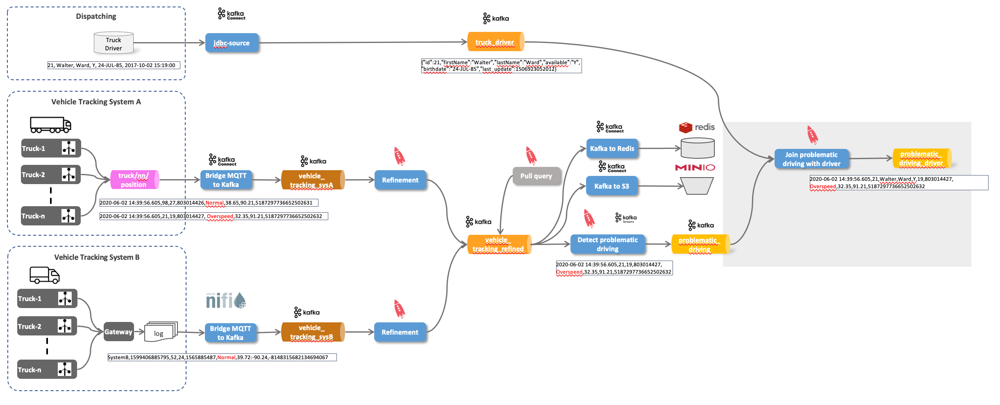

## Vehicle Tracking Demo with Kafka


## Demo 1 - Consume Vehicle Tracking messages from MQTT and send to Kafka


``` bash
docker run trivadis/iot-truck-simulator '-s' 'MQTT' '-h' $DOCKER_HOST_IP '-p' '1883' '-f' 'JSON' '-vf' '1-49'
```

``` bash
docker run -it --rm efrecon/mqtt-client sub -h $DOCKER_HOST_IP -t "truck/+/position" -v
```

```bash
curl -XGET http://dataplatform:8083/connector-plugins | jq
```

```bash
docker exec -it kafka-1 kafka-topics --zookeeper zookeeper-1:2181 --create --topic vehicle_tracking_sysA --partitions 8 --replication-factor 3
```

[Confluent Connector Hub](https://www.confluent.io/hub/)

```bash
curl -X "POST" "$DOCKER_HOST_IP:8083/connectors" \
     -H "Content-Type: application/json" \
     --data '{
  "name": "mqtt-vehicle-position-source",
  "config": {
    "connector.class": "io.confluent.connect.mqtt.MqttSourceConnector",
    "tasks.max": "1",
    "mqtt.server.uri": "tcp://mosquitto-1:1883",
    "mqtt.topics": "truck/+/position",
    "mqtt.clean.session.enabled":"true",
    "mqtt.connect.timeout.seconds":"30",
    "mqtt.keepalive.interval.seconds":"60",
    "mqtt.qos":"0",
    "kafka.topic":"vehicle_tracking_sysA",
    "confluent.topic.bootstrap.servers": "kafka-1:19092,kafka-2:19093",
    "confluent.topic.replication.factor": "3",
    "key.converter": "org.apache.kafka.connect.storage.StringConverter",
    "value.converter": "org.apache.kafka.connect.converters.ByteArrayConverter"
    }
  }'
```


```bash
docker exec -ti kafkacat kafkacat -b kafka-1 -t vehicle_tracking_sysA
```

## Demo 2 - Using KSQL to Refine the data


### What is ksqlDB?


[_Source: Confluent_](https://docs.ksqldb.io/en/latest/)

``` bash
docker exec -it ksqldb-cli ksql http://ksqldb-server-1:8088
```

```sql
show topics;
```

```sql
print 'vehicle_tracking';
```

```sql
show streams;
show tables;
show queries;
```

``` sql
DROP STREAM IF EXISTS vehicle_tracking_sysA_s;
```

[CREATE STREAM](https://docs.ksqldb.io/en/latest/developer-guide/ksqldb-reference/create-stream/)

``` sql
CREATE STREAM IF NOT EXISTS vehicle_tracking_sysA_s 
  (mqttTopic VARCHAR KEY,
  timestamp VARCHAR, 
   truckId VARCHAR, 
   driverId BIGINT, 
   routeId BIGINT,
   eventType VARCHAR,
   latitude DOUBLE,
   longitude DOUBLE,
   correlationId VARCHAR)
  WITH (kafka_topic='vehicle_tracking_sysA',
        value_format='JSON');
```

``` sql
SELECT * FROM vehicle_tracking_sysA_s EMIT CHANGES;
```

```sql
DESCRIBE vehicle_tracking_sysA_s;
DESCRIBE EXTENDED vehicle_tracking_sysA_s;
```

``` sql
DROP STREAM IF EXISTS vehicle_tracking_refined_s;
```

[CREATE STREAM AS SELECT](https://docs.ksqldb.io/en/latest/developer-guide/ksqldb-reference/create-stream-as-select/)

``` sql
CREATE STREAM IF NOT EXISTS vehicle_tracking_refined_s 
  WITH (kafka_topic='vehicle_tracking_refined',
        value_format='AVRO',
        VALUE_AVRO_SCHEMA_FULL_NAME='com.trivadis.avro.VehicleTrackingRefined')
AS SELECT truckId AS ROWKEY
		, 'Tracking_SysA' AS source
		, timestamp
		, AS_VALUE(truckId) AS vehicleId
		, driverId
		, routeId
		, eventType
		, latitude
		, longitude
		, correlationId
FROM vehicle_tracking_sysA_s
PARTITION BY truckId
EMIT CHANGES;
```

``` bash
docker exec -ti kafkacat kafkacat -b kafka-1 -t vehicle_tracking_refined
```

``` bash
docker exec -ti kafkacat kafkacat -b kafka-1 -t vehicle_tracking_refined -s avro -r http://schema-registry-1:8081
```

## Demo 3 - Integrate System B


cd platys-iot-trucking

```bash
docker run -v "${PWD}/data-transfer/logs:/out" --rm trivadis/iot-truck-simulator "-s" "FILE" "-f" "CSV" "-d" "1000" "-vf" "50-100" "-es" "2"
```

```bash
tail -f data-transfer/logs/TruckData.dat
```

<http://http://dataplatform:18630/>

```bash
docker exec -ti kafkacat kafkacat -b kafka-1 -t vehicle_tracking_sysB -f "%k - %s\n" -q
```

## Demo 4 - Refinement of data from System B into same topic as above


```sql
DROP STREAM IF EXISTS vehicle_tracking_sysB_s;
```

```sql
CREATE STREAM IF NOT EXISTS vehicle_tracking_sysB_s 
  (ROWKEY VARCHAR KEY,
   system VARCHAR,
   timestamp VARCHAR, 
   vehicleId VARCHAR, 
   driverId BIGINT, 
   routeId BIGINT,
   eventType VARCHAR,
   latLong VARCHAR,
   correlationId VARCHAR)
  WITH (kafka_topic='vehicle_tracking_sysB',
        value_format='DELIMITED');
```

```sql
DESCRIBE vehicle_tracking_sysB_s;
DESCRIBE vehicle_tracking_refined_s;
```

[INSERT INTO](https://docs.ksqldb.io/en/latest/developer-guide/ksqldb-reference/quick-reference/#insert-into)

``` sql
INSERT INTO vehicle_tracking_refined_s 
SELECT ROWKEY
	, timestamp
	, vehicleId
	, driverId
	, routeId
	, eventType
	, cast(split(latLong,':')[1] as DOUBLE) as latitude
	, CAST(split(latLong,':')[2] AS DOUBLE) as longitude
	, correlationId
FROM vehicle_tracking_sysB_s
EMIT CHANGES;
```

```
SELECT source, count(*) FROM vehicle_tracking_refined_s 
GROUP BY source
EMIT CHANGES;
```

## Demo 5 - Pull Query on Vehicle Tracking Info ("Device Shadow")


Pull query on Stream does not work

``` sql
SELECT * FROM vehicle_tracking_refined_s WHERE vehicleId = 42;
```

``` sql
DROP TABLE IF EXISTS vehicle_tracking_refined_t;
```

``` sql
CREATE TABLE IF NOT EXISTS vehicle_tracking_refined_t
WITH (kafka_topic = 'vehicle_tracking_refined_t')
AS
SELECT vehicleId
       , latest_by_offset(driverId)	   driverId
		, latest_by_offset(source)			source
		, latest_by_offset(eventType)		eventType
		, latest_by_offset(latitude)		latitude
		, latest_by_offset(longitude)		longitude
FROM vehicle_tracking_refined_s
GROUP BY vehicleId
EMIT CHANGES;
```

## Demo 6 - Investigate Driving behaviour


``` sql
SELECT * FROM vehicle_tracking_refined_s 
WHERE eventType != 'Normal'
EMIT CHANGES;
```

Now let's create a new stream with that information. 

``` sql
DROP STREAM IF EXISTS problematic_driving_s;
```

``` sql
CREATE STREAM IF NOT EXISTS problematic_driving_s \
  WITH (kafka_topic='problematic_driving', \
        value_format='AVRO', \
        partitions=8) \
AS 
SELECT * 
FROM vehicle_tracking_refined_s \
WHERE eventtype != 'Normal';
```

``` sql
SELECT * FROM problematic_driving_s
EMIT CHANGES;
```

``` bash
docker exec -ti kafkacat kafkacat -b kafka-1 -t problematic_driving -s avro -r http://schema-registry-1:8081
```


## Demo 7 - Materialize Driver Information ("static information")


```bash
docker exec -it kafka-1 kafka-topics --zookeeper zookeeper-1:2181 --create --topic logisticsdb_driver --partitions 8 --replication-factor 3 --config cleanup.policy=compact --config segment.ms=100 --config delete.retention.ms=100 --config min.cleanable.dirty.ratio=0.001
```

[Kafka Connect JDBC Connector](https://docs.confluent.io/current/connect/kafka-connect-jdbc/index.html#connect-jdbc)

``` sql
DROP CONNECTOR jdbc_logistics_sc;
```

``` sql
CREATE SOURCE CONNECTOR jdbc_logistics_sc WITH (
    "connector.class"='io.confluent.connect.jdbc.JdbcSourceConnector',
    "tasks.max" = '1',
    "connection.url" = 'jdbc:postgresql://postgresql/demodb?user=demo&password=abc123!',
    "mode" = 'timestamp',
    "timestamp.column.name" = 'last_update',
    "schema.pattern" = 'logistics_db',
    "table.whitelist" = 'driver',
    "validate.non.null" = 'false',
    "topic.prefix" = 'logisticsdb_',
    "poll.interval.ms" = '10000',
    "key.converter" = 'org.apache.kafka.connect.converters.LongConverter',
    "key.converter.schemas.enable" = 'false',
    "value.converter" = 'org.apache.kafka.connect.json.JsonConverter',
    "value.converter.schemas.enable" = 'false',
    "transforms" = 'createKey,extractInt',
    "transforms.createKey.type" = 'org.apache.kafka.connect.transforms.ValueToKey',
    "transforms.createKey.fields" = 'id',
    "transforms.extractInt.type" = 'org.apache.kafka.connect.transforms.ExtractField$Key',
    "transforms.extractInt.field" = 'id'
    );
```

``` sql
DROP TABLE IF EXISTS driver_t;
```

``` sql
CREATE TABLE IF NOT EXISTS driver_t (id BIGINT PRIMARY KEY,
   first_name VARCHAR,  
   last_name VARCHAR,  
   available VARCHAR, 
   birthdate VARCHAR)  
  WITH (kafka_topic='logisticsdb_driver', 
        value_format='JSON');
```

## Demo 8 - Join with Driver ("static information")


``` sql
SELECT pd.driverId, d.first_name, d.last_name, d.available, pd.vehicleId, pd.routeId, pd.eventType 
FROM problematic_driving_s 	pd
LEFT JOIN driver_t 				d
ON pd.driverId  = d.id
EMIT CHANGES;
```


```bash
docker exec -ti postgresql psql -d demodb -U demo
```

```sql
UPDATE logistics_db.driver SET available = 'N', last_update = CURRENT_TIMESTAMP  WHERE id = 11;
```
### Demo 9 - Aggregate Driving Behaviour

### 


``` sql
DROP TABLE IF EXISTS event_type_by_5min_t;
```

``` sql
CREATE TABLE event_type_by_1hour_tumbl_t AS
SELECT windowstart AS winstart
	, windowend 	AS winend
	, eventType
	, count(*) 	AS nof 
FROM problematic_driving_s 
WINDOW TUMBLING (SIZE 60 minutes)
GROUP BY eventType;
```

``` sql
CREATE TABLE event_type_by_1hour_hopp_t AS
SELECT windowstart AS winstart
	, windowend 	AS winend
	, eventType
	, count(*) 	AS nof 
FROM problematic_driving_s 
WINDOW HOPPING (SIZE 60 minutes, ADVANCE BY 30 minutes)
GROUP BY eventType;
```

## Demo 10 - Materialize Shipment Information ("static information")


```sql
CREATE USER 'debezium'@'%' IDENTIFIED WITH mysql_native_password BY 'dbz';
CREATE USER 'replicator'@'%' IDENTIFIED BY 'replpass';
GRANT SELECT, RELOAD, SHOW DATABASES, REPLICATION SLAVE, REPLICATION CLIENT  ON *.* TO 'debezium';
GRANT REPLICATION SLAVE, REPLICATION CLIENT ON *.* TO 'replicator';

GRANT SELECT, INSERT, UPDATE, DELETE ON sample.* TO sample;

USE sample;

DROP TABLE shipment;

CREATE TABLE shipment (
                id INT PRIMARY KEY,
                vehicle_id INT,
                target_wkt VARCHAR(2000),
                create_ts timestamp DEFAULT CURRENT_TIMESTAMP,
                update_ts timestamp DEFAULT CURRENT_TIMESTAMP ON UPDATE CURRENT_TIMESTAMP
);
                
INSERT INTO shipment (id, vehicle_id, target_wkt)  VALUES (1,11, 'POLYGON ((-91.29638671875 39.04478604850143, -91.4501953125 38.46219172306828, -90.98876953125 37.94419750075404, -89.912109375 37.78808138412046, -88.9892578125 38.37611542403604, -88.92333984375 38.77121637244273, -89.71435546875 39.470125122358176, -90.19775390625 39.825413103424786, -91.29638671875 39.04478604850143))');     

INSERT INTO shipment (id, vehicle_id, target_wkt)  VALUES (2, 42, 'POLYGON ((-91.29638671875 39.04478604850143, -91.4501953125 38.46219172306828, -90.98876953125 37.94419750075404, -89.912109375 37.78808138412046, -88.9892578125 38.37611542403604, -88.92333984375 38.77121637244273, -89.71435546875 39.470125122358176, -90.19775390625 39.825413103424786, -91.29638671875 39.04478604850143))');         

INSERT INTO shipment (id, vehicle_id, target_wkt)  VALUES (3, 12, 'POLYGON ((-91.29638671875 39.04478604850143, -91.4501953125 38.46219172306828, -90.98876953125 37.94419750075404, -89.912109375 37.78808138412046, -88.9892578125 38.37611542403604, -88.92333984375 38.77121637244273, -89.71435546875 39.470125122358176, -90.19775390625 39.825413103424786, -91.29638671875 39.04478604850143))'); 
                
INSERT INTO shipment (id, vehicle_id, target_wkt)  VALUES (4, 13, 'POLYGON ((-91.29638671875 39.04478604850143, -91.4501953125 38.46219172306828, -90.98876953125 37.94419750075404, -89.912109375 37.78808138412046, -88.9892578125 38.37611542403604, -88.92333984375 38.77121637244273, -89.71435546875 39.470125122358176, -90.19775390625 39.825413103424786, -91.29638671875 39.04478604850143))'); 

INSERT INTO shipment (id, vehicle_id, target_wkt)  VALUES (5, 14, 'POLYGON ((-91.29638671875 39.04478604850143, -91.4501953125 38.46219172306828, -90.98876953125 37.94419750075404, -89.912109375 37.78808138412046, -88.9892578125 38.37611542403604, -88.92333984375 38.77121637244273, -89.71435546875 39.470125122358176, -90.19775390625 39.825413103424786, -91.29638671875 39.04478604850143))'); 

INSERT INTO shipment (id, vehicle_id, target_wkt)  VALUES (6, 15, 'POLYGON ((-91.29638671875 39.04478604850143, -91.4501953125 38.46219172306828, -90.98876953125 37.94419750075404, -89.912109375 37.78808138412046, -88.9892578125 38.37611542403604, -88.92333984375 38.77121637244273, -89.71435546875 39.470125122358176, -90.19775390625 39.825413103424786, -91.29638671875 39.04478604850143))'); 

INSERT INTO shipment (id, vehicle_id, target_wkt)  VALUES (7, 32, 'POLYGON ((-91.29638671875 39.04478604850143, -91.4501953125 38.46219172306828, -90.98876953125 37.94419750075404, -89.912109375 37.78808138412046, -88.9892578125 38.37611542403604, -88.92333984375 38.77121637244273, -89.71435546875 39.470125122358176, -90.19775390625 39.825413103424786, -91.29638671875 39.04478604850143))'); 

INSERT INTO shipment (id, vehicle_id, target_wkt)  VALUES (8, 48, 'POLYGON ((-91.29638671875 39.04478604850143, -91.4501953125 38.46219172306828, -90.98876953125 37.94419750075404, -89.912109375 37.78808138412046, -88.9892578125 38.37611542403604, -88.92333984375 38.77121637244273, -89.71435546875 39.470125122358176, -90.19775390625 39.825413103424786, -91.29638671875 39.04478604850143))'); 
```


```bash
docker exec -it kafka-1 kafka-topics --zookeeper zookeeper-1:2181 --create --topic sample.sample.shipment --partitions 8 --replication-factor 3 --config cleanup.policy=compact --config segment.ms=100 --config delete.retention.ms=100 --config min.cleanable.dirty.ratio=0.001
```


```sql
DROP CONNECTOR debz_shipment_sc;

CREATE SOURCE CONNECTOR debz_shipment_sc WITH (
    'connector.class' = 'io.debezium.connector.mysql.MySqlConnector',
    'database.hostname' = 'mysql',
    'database.port' = '3306',
    'database.user' = 'debezium',
    'database.password' = 'dbz',
    'database.server.id' = '42',
    'database.server.name' = 'sample',
    'table.whitelist' = 'sample.shipment',
    'database.history.kafka.bootstrap.servers' = 'kafka-1:19092',
    'database.history.kafka.topic' = 'dbhistory.sample' ,
    'schema_only_recovery' = 'true',
    'include.schema.changes' = 'false',
    'transforms'= 'unwrap, extractkey',
    'transforms.unwrap.type'= 'io.debezium.transforms.ExtractNewRecordState',
    'transforms.extractkey.type'= 'org.apache.kafka.connect.transforms.ExtractField$Key',
    'transforms.extractkey.field'= 'id',
    'key.converter'= 'org.apache.kafka.connect.storage.StringConverter',
    'value.converter'= 'io.confluent.connect.avro.AvroConverter',
    'value.converter.schema.registry.url'= 'http://schema-registry-1:8081'
    );
```


``` sql
DROP TABLE IF EXISTS shipment_t;

CREATE TABLE IF NOT EXISTS shipment_t (id VARCHAR PRIMARY KEY,
   vehicle_id INTEGER,  
   target_wkt VARCHAR)  
  WITH (kafka_topic='sample.sample.shipment', 
        value_format='AVRO');
```

```sql
SELECT * FROM shipment_t EMIT CHANGES;
```

Destination is St. Louis: <http://geojson.io/>


```wkt
POLYGON ((-91.29638671875 39.04478604850143, -91.4501953125 38.46219172306828, -90.98876953125 37.94419750075404, -89.912109375 37.78808138412046, -88.9892578125 38.37611542403604, -88.92333984375 38.77121637244273, -89.71435546875 39.470125122358176, -90.19775390625 39.825413103424786, -91.29638671875 39.04478604850143))
```

## Demo 11 - Geo-Fencing for "near" destination


### What is Geo Fencing?


```sql
DROP TABLE IF EXISTS shipment_by_vehicle_t;

CREATE TABLE shipment_by_vehicle_t
AS SELECT vehicle_id, collect_list(target_wkt) AS target_wkts
FROM shipment_t
GROUP BY vehicle_id;
```

```sql
SELECT vtr.vehicleId
		,array_lag(collect_list(geo_fence(vtr.latitude, vtr.longitude, sbv.target_wkts[1])),1) AS status_before
		,array_lag(collect_list(geo_fence(vtr.latitude, vtr.longitude, sbv.target_wkts[1])),0) AS status_now
FROM vehicle_tracking_refined_s	vtr
LEFT JOIN shipment_by_vehicle_t	sbv
ON CAST (vtr.vehicleId AS INTEGER) = sbv.vehicle_id
WHERE sbv.target_wkts IS NOT NULL
GROUP BY vehicleId
EMIT CHANGES;
```

```sql
CREATE TABLE geo_fence_status_t AS
SELECT vtr.vehicleId
		, geo_fence (array_lag(collect_list(geo_fence(vtr.latitude, vtr.longitude, sbv.target_wkts[1])),1) ,
					array_lag(collect_list(geo_fence(vtr.latitude, vtr.longitude, sbv.target_wkts[1])),0) 
					) AS status
FROM vehicle_tracking_refined_s	vtr
LEFT JOIN shipment_by_vehicle_t	sbv
ON CAST (vtr.vehicleId AS INTEGER) = sbv.vehicle_id
WHERE sbv.target_wkts IS NOT NULL
GROUP BY vehicleId
EMIT CHANGES;
```
