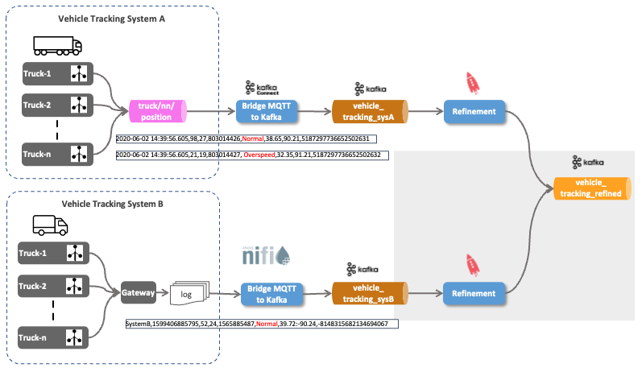
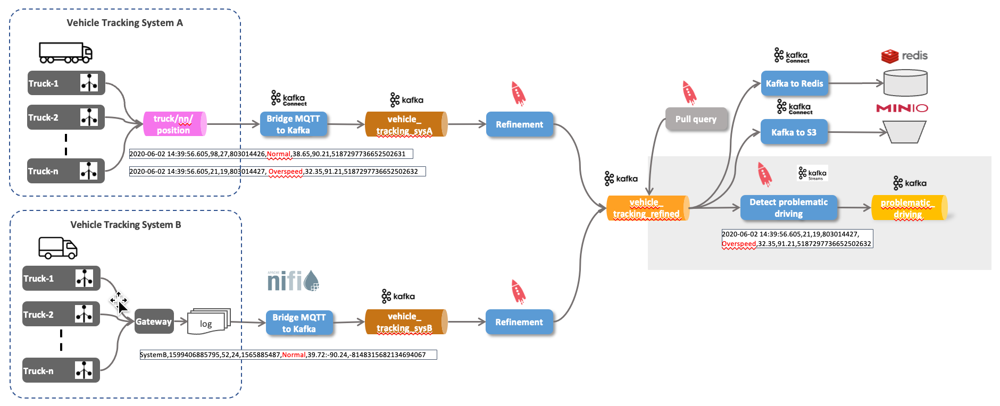

## Vehicle Tracking Demo with Kafka


## Demo 1 - Consume Vehicle Tracking messages from MQTT and send to Kafka


``` bash
docker run trivadis/iot-truck-simulator '-s' 'MQTT' '-h' $DOCKER_HOST_IP '-p' '1883' '-f' 'JSON' '-vf' '1-49'
```

``` bash
docker run -it --rm efrecon/mqtt-client sub -h $DOCKER_HOST_IP -t "truck/+/position" -v
```

```bash
curl -XGET http://dataplatform:8083/connector-plugins | jq
```

```bash
docker exec -it kafka-1 kafka-topics --zookeeper zookeeper-1:2181 --create --topic vehicle_tracking_sysA --partitions 8 --replication-factor 3
```


```bash
curl -X "POST" "$DOCKER_HOST_IP:8083/connectors" \
     -H "Content-Type: application/json" \
     --data '{
  "name": "mqtt-vehicle-position-source",
  "config": {
    "connector.class": "io.confluent.connect.mqtt.MqttSourceConnector",
    "tasks.max": "1",
    "mqtt.server.uri": "tcp://mosquitto-1:1883",
    "mqtt.topics": "truck/+/position",
    "mqtt.clean.session.enabled":"true",
    "mqtt.connect.timeout.seconds":"30",
    "mqtt.keepalive.interval.seconds":"60",
    "mqtt.qos":"0",
    "kafka.topic":"vehicle_tracking_sysA",
    "confluent.topic.bootstrap.servers": "kafka-1:19092,kafka-2:19093",
    "confluent.topic.replication.factor": "3",
    "key.converter": "org.apache.kafka.connect.storage.StringConverter",
    "value.converter": "org.apache.kafka.connect.converters.ByteArrayConverter"
    }
  }'
```


```bash
docker exec -ti kafkacat kafkacat -b kafka-1 -t vehicle_tracking_sysA
```

## Demo 2 - Using KSQL to Refine the data


``` bash
docker exec -it ksqldb-cli ksql http://ksqldb-server-1:8088
```

```sql
show topics;
```

```sql
print 'vehicle_tracking';
```

```sql
show streams;
show tables;
show queries;
```

``` sql
DROP STREAM IF EXISTS vehicle_tracking_sysA_s;
```

[CREATE STREAM](https://docs.ksqldb.io/en/latest/developer-guide/ksqldb-reference/create-stream/)

``` sql
CREATE STREAM IF NOT EXISTS vehicle_tracking_sysA_s 
  (mqttTopic VARCHAR KEY,
  timestamp VARCHAR, 
   truckId VARCHAR, 
   driverId BIGINT, 
   routeId BIGINT,
   eventType VARCHAR,
   latitude DOUBLE,
   longitude DOUBLE,
   correlationId VARCHAR)
  WITH (kafka_topic='vehicle_tracking_sysA',
        value_format='JSON');
```

``` sql
SELECT * FROM vehicle_tracking_sysA_s EMIT CHANGES;
```

```sql
DESCRIBE vehicle_tracking_sysA_s;
DESCRIBE EXTENDED vehicle_tracking_sysA_s;
```

``` sql
DROP STREAM IF EXISTS vehicle_tracking_refined_s;
```

[CREATE STREAM AS SELECT](https://docs.ksqldb.io/en/latest/developer-guide/ksqldb-reference/create-stream-as-select/)

``` sql
CREATE STREAM IF NOT EXISTS vehicle_tracking_refined_s 
  WITH (kafka_topic='vehicle_tracking_refined',
        value_format='AVRO',
        VALUE_AVRO_SCHEMA_FULL_NAME='com.trivadis.avro.VehicleTrackingRefined')
AS SELECT truckId AS ROWKEY
		, 'Tracking_SysA' AS source
		, timestamp
		, AS_VALUE(truckId) AS vehicleId
		, driverId
		, routeId
		, eventType
		, latitude
		, longitude
		, correlationId
FROM vehicle_tracking_sysA_s
PARTITION BY truckId
EMIT CHANGES;
```

``` bash
docker exec -ti kafkacat kafkacat -b kafka-1 -t vehicle_tracking_refined
```

``` bash
docker exec -ti kafkacat kafkacat -b kafka-1 -t vehicle_tracking_refined -s avro -r http://schema-registry-1:8081
```

## Demo 3 - Integrate System B


cd platys-iot-trucking

```bash
docker run -v "${PWD}/data-transfer/logs:/out" --rm trivadis/iot-truck-simulator "-s" "FILE" "-f" "CSV" "-d" "1000" "-vf" "50-100" "-es" "2"
```

```bash
tail -f data-transfer/logs/TruckData.dat
```

<http://http://dataplatform:18630/>

```bash
docker exec -ti kafkacat kafkacat -b kafka-1 -t vehicle_tracking_sysB -f "%k - %s\n" -q
```

## Demo 4 - Refinement of data from System B into same topic as above



```sql
DROP STREAM IF EXISTS vehicle_tracking_sysB_s;
```

```sql
CREATE STREAM IF NOT EXISTS vehicle_tracking_sysB_s 
  (ROWKEY VARCHAR KEY,
   system VARCHAR,
   timestamp VARCHAR, 
   vehicleId VARCHAR, 
   driverId BIGINT, 
   routeId BIGINT,
   eventType VARCHAR,
   latLong VARCHAR,
   correlationId VARCHAR)
  WITH (kafka_topic='vehicle_tracking_sysB',
        value_format='DELIMITED');
```

```sql
DESCRIBE vehicle_tracking_sysB_s;
DESCRIBE vehicle_tracking_refined_s;
```

[INSERT INTO](https://docs.ksqldb.io/en/latest/developer-guide/ksqldb-reference/quick-reference/#insert-into)

``` sql
INSERT INTO vehicle_tracking_refined_s 
SELECT ROWKEY
	, timestamp
	, vehicleId
	, driverId
	, routeId
	, eventType
	, cast(split(latLong,':')[1] as DOUBLE) as latitude
	, CAST(split(latLong,':')[2] AS DOUBLE) as longitude
	, correlationId
FROM vehicle_tracking_sysB_s
EMIT CHANGES;
```

```
SELECT source, count(*) FROM vehicle_tracking_refined_s 
GROUP BY source
EMIT CHANGES;
```

## Demo 5 - Investigate Driving behaviour


``` sql
SELECT * FROM vehicle_tracking_refined_s 
WHERE eventType != 'Normal'
EMIT CHANGES;
```

Now let's create a new stream with that information. 

``` sql
DROP STREAM IF EXISTS problematic_driving_s;
```

``` sql
CREATE STREAM IF NOT EXISTS problematic_driving_s \
  WITH (kafka_topic='problematic_driving', \
        value_format='AVRO', \
        partitions=8) \
AS 
SELECT * 
FROM vehicle_tracking_refined_s \
WHERE eventtype != 'Normal';
```

``` sql
SELECT * FROM problematic_driving_s
EMIT CHANGES;
```

``` bash
docker exec -ti kafkacat kafkacat -b kafka-1 -t problematic_driving -s avro -r http://schema-registry-1:8081
```


## Demo 6 - Materialize Driver Information ("static information")


```bash
docker exec -it kafka-1 kafka-topics --zookeeper zookeeper-1:2181 --create --topic logisticsdb_driver --partitions 8 --replication-factor 3 --config cleanup.policy=compact --config segment.ms=100 --config delete.retention.ms=100 --config min.cleanable.dirty.ratio=0.001
```

[Kafka Connect JDBC Connector](https://docs.confluent.io/current/connect/kafka-connect-jdbc/index.html#connect-jdbc)

``` sql
DROP CONNECTOR jdbc_logistics_sc;
```

``` sql
CREATE SOURCE CONNECTOR jdbc_logistics_sc WITH (
    "connector.class"='io.confluent.connect.jdbc.JdbcSourceConnector',
    "tasks.max" = '1',
    "connection.url" = 'jdbc:postgresql://postgresql/demodb?user=demo&password=abc123!',
    "mode" = 'timestamp',
    "timestamp.column.name" = 'last_update',
    "schema.pattern" = 'logistics_db',
    "table.whitelist" = 'driver',
    "validate.non.null" = 'false',
    "topic.prefix" = 'logisticsdb_',
    "poll.interval.ms" = '10000',
    "key.converter" = 'org.apache.kafka.connect.converters.LongConverter',
    "key.converter.schemas.enable" = 'false',
    "value.converter" = 'org.apache.kafka.connect.json.JsonConverter',
    "value.converter.schemas.enable" = 'false',
    "transforms" = 'createKey,extractInt',
    "transforms.createKey.type" = 'org.apache.kafka.connect.transforms.ValueToKey',
    "transforms.createKey.fields" = 'id',
    "transforms.extractInt.type" = 'org.apache.kafka.connect.transforms.ExtractField$Key',
    "transforms.extractInt.field" = 'id'
    );
```

``` sql
DROP TABLE IF EXISTS driver_t;
```

``` sql
CREATE TABLE IF NOT EXISTS driver_t (id BIGINT PRIMARY KEY,
   first_name VARCHAR,  
   last_name VARCHAR,  
   available VARCHAR, 
   birthdate VARCHAR)  
  WITH (kafka_topic='logisticsdb_driver', 
        value_format='JSON');
```

## Demo 7 - Join with Driver ("static information")




``` sql
SELECT pd.driverId, d.first_name, d.last_name, d.available, pd.vehicleId, pd.routeId, pd.eventType 
FROM problematic_driving_s 	pd
LEFT JOIN driver_t 				d
ON pd.driverId  = d.id
EMIT CHANGES;
```


```bash
docker exec -ti postgresql psql -d demodb -U demo
```

```sql
UPDATE logistics_db.driver SET available = 'N', last_update = CURRENT_TIMESTAMP  WHERE id = 11;
```
## Demo 8 - Aggregate Driving Behaviour


## Demo 9 - Materialize Shipment Information ("static information")


## Demo 10 - Geo-Fencing for "near" destination


