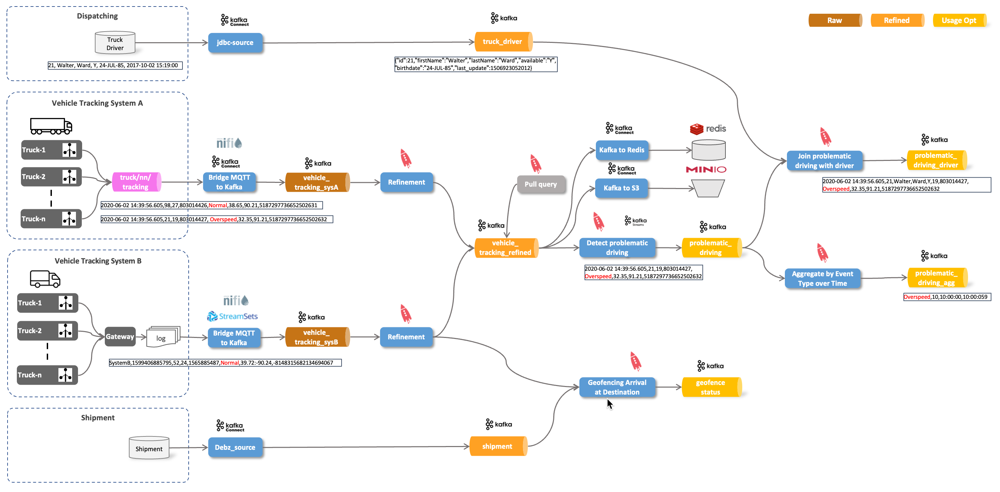
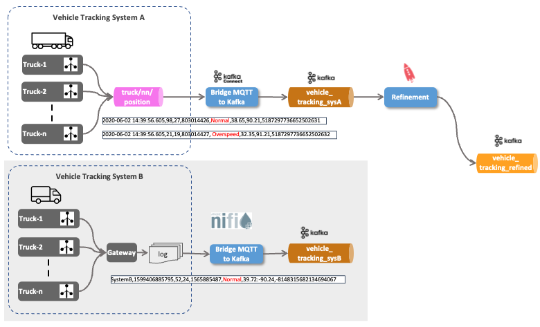
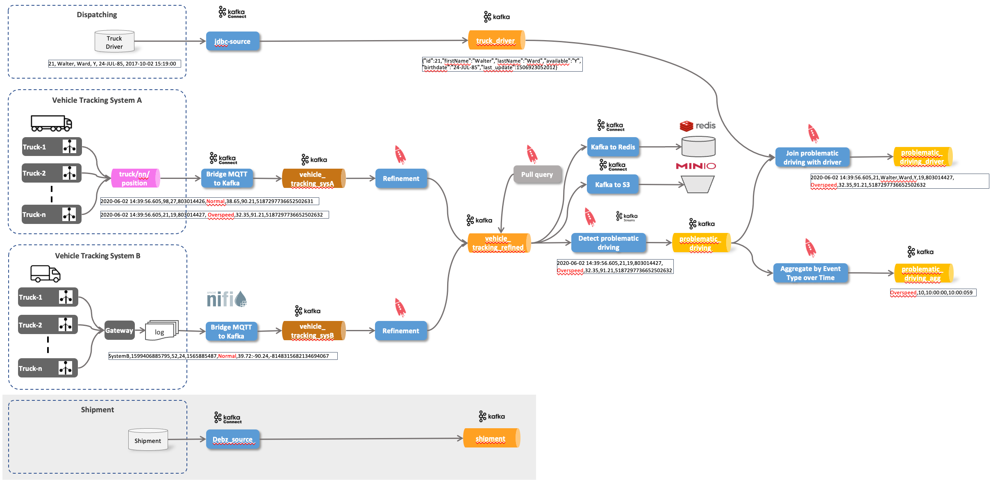

## Vehicle Tracking Demo with Kafka



```
export DATAPLATFORM_HOME=/home/docker/iot-vehicle-tracking-demo/docker
```

## Demo 0 - Write Vehicle Tracking message directly to Kafka

``` bash
docker run trivadis/iot-truck-simulator '-s' 'KAFKA' '-h' $DOCKER_HOST_IP '-p' '9092' '-f' 'JSON' '-vf' '1-49'
```

## Demo 1 - Consume Vehicle Tracking messages from MQTT and send to Kafka


``` bash
docker run --network host --rm trivadis/iot-truck-simulator '-s' 'MQTT' '-h' $DOCKER_HOST_IP '-p' '1883' '-f' 'JSON' '-vf' '1-49'
```

``` bash
docker run -it --rm --name mqttclient efrecon/mqtt-client sub -h "$DOCKER_HOST_IP" -p 1883 -t "truck/+/position" -v
```


[Confluent Hub](https://www.confluent.io/hub/)

```bash
curl -XGET http://dataplatform:8083/connector-plugins | jq
```

<http://dataplatform:8083/connector-plugins>

adding MQTT Connector


```bash
cd $DATAPLATFORM_HOME/plugins/kafka-connect/connectors
```

```bash
sudo wget https://github.com/lensesio/stream-reactor/releases/download/4.2.0/kafka-connect-mqtt-4.2.0.zip
```

```bash
sudo unzip kafka-connect-mqtt-4.2.0.zip
sudo rm kafka-connect-mqtt-4.2.0.zip
```

```bash
cd $DATAPLATFORM_HOME
docker compose restart kafka-connect-1 kafka-connect-2
```

```bash
docker compose logs -f kafka-connect-1 kafka-connect-2
```


create the topic

```bash
docker exec -it kafka-1 kafka-topics --bootstrap-server kafka-1:19092 --create --topic vehicle_tracking_sysA --partitions 8 --replication-factor 3
```


```bash
docker exec -ti kcat kcat -b kafka-1 -t vehicle_tracking_sysA -f "%k - %s\n" -q
```

```bash
kcat -b dataplatform -t vehicle_tracking_sysA -f "%k - %s\n" -q
```

```bash
curl -XGET http://dataplatform:8083/connector-plugins | jq
```

```bash
curl -X PUT \
  http://${DOCKER_HOST_IP}:8083/connectors/mqtt-source/config \
  -H 'Content-Type: application/json' \
  -H 'Accept: application/json' \
  -d '{
    "connector.class": "com.datamountaineer.streamreactor.connect.mqtt.source.MqttSourceConnector",
    "connect.mqtt.connection.timeout": "1000",
    "tasks.max": "1",
    "connect.mqtt.kcql": "INSERT INTO vehicle_tracking_sysA SELECT * FROM truck/+/position WITHCONVERTER=`com.datamountaineer.streamreactor.connect.converters.source.JsonSimpleConverter` WITHKEY(truckId)",
    "connect.mqtt.connection.clean": "true",
    "connect.mqtt.service.quality": "0",
    "connect.mqtt.connection.keep.alive": "1000",
    "connect.mqtt.client.id": "tm-mqtt-connect-01",
    "connect.mqtt.converter.throw.on.error": "true",
    "connect.mqtt.hosts": "tcp://mosquitto-1:1883",
    "key.converter": "org.apache.kafka.connect.json.JsonConverter",
    "key.converter.schemas.enable": "false",
    "value.converter": "org.apache.kafka.connect.json.JsonConverter",
    "value.converter.schemas.enable": "false"
}'
```

## Demo 2 - Using KSQL to Refine the data


### What is ksqlDB?


[_Source: Confluent_](https://docs.ksqldb.io/en/latest/)

``` bash
docker exec -it ksqldb-cli ksql http://ksqldb-server-1:8088
```

```sql
show topics;
```

```sql
print 'vehicle_tracking_sysA';
```

```sql
show streams;
show tables;
show queries;
```

``` sql
DROP STREAM IF EXISTS vehicle_tracking_sysA_s;
```

* [CREATE STREAM](https://docs.ksqldb.io/en/latest/developer-guide/ksqldb-reference/create-stream/)

``` sql
CREATE STREAM IF NOT EXISTS vehicle_tracking_sysA_s 
  (mqttTopic VARCHAR KEY,
  timestamp VARCHAR, 
   truckId VARCHAR, 
   driverId BIGINT, 
   routeId BIGINT,
   eventType VARCHAR,
   latitude DOUBLE,
   longitude DOUBLE,
   correlationId VARCHAR)
  WITH (kafka_topic='vehicle_tracking_sysA',
        value_format='JSON');
```

#### push query


```sql
DESCRIBE vehicle_tracking_sysA_s;
```

``` sql
SELECT * FROM vehicle_tracking_sysA_s EMIT CHANGES;
```

* [CREATE STREAM AS SELECT](https://docs.ksqldb.io/en/latest/developer-guide/ksqldb-reference/create-stream-as-select/)

``` sql
DROP STREAM IF EXISTS vehicle_tracking_refined_s;
```

* [Schema Registry](http://dataplatform:28102/#/)
* [Apache Avro](http://avro.apache.org)


``` sql
CREATE STREAM IF NOT EXISTS vehicle_tracking_refined_s 
  WITH (kafka_topic='vehicle_tracking_refined',
        value_format='AVRO',
        VALUE_AVRO_SCHEMA_FULL_NAME='com.trivadis.avro.VehicleTrackingRefined')
AS SELECT truckId AS ROWKEY
		, 'Tracking_SysA' AS source
		, timestamp
		, AS_VALUE(truckId) AS vehicleId
		, driverId
		, routeId
		, eventType
		, latitude
		, longitude
		, correlationId
FROM vehicle_tracking_sysA_s
PARTITION BY truckId
EMIT CHANGES;
```

``` bash
docker exec -ti kcat kcat -b kafka-1:19092 -t vehicle_tracking_refined
```

``` bash
docker exec -ti kcat kcat -b kafka-1:19092 -t vehicle_tracking_refined -s value=avro -r http://schema-registry-1:8081
```

## Demo 3 - Integrate System B



```bash
cd $DATAPLATFORM_HOME
sudo rm data-transfer/logs/TruckData.dat
```

```bash
docker run --rm -v "${DATAPLATFORM_HOME}/data-transfer/logs:/out" --rm trivadis/iot-truck-simulator "-s" "FILE" "-f" "CSV" "-d" "1000" "-vf" "50-100" "-es" "2"
```

```bash
tail -f $DATAPLATFORM_HOME/data-transfer/logs/TruckData.dat
```

``` bash
docker exec -it kafka-1 kafka-topics --bootstrap-server kafka-1:19092 --create --topic vehicle_tracking_sysB --partitions 8 --replication-factor 3
```

Upload the NiFi Template `nifi/tailfile-to-kafka.xml` into Apache NiFi. 


now import the template into the canvas


After the flow is loaded, enable all controller services by right-clicking on the canvas and select **Enable all controller services**. Now you can start the flow by selecting all processors and clicking the **start** icon. 


```bash
docker exec -ti kcat kcat -b kafka-1:19092 -t vehicle_tracking_sysB -f "%k - %s\n" -q
```

## Demo 4 - Refinement of data from System B into same topic as above


``` bash
docker exec -it ksqldb-cli ksql http://ksqldb-server-1:8088
```

```sql
DROP STREAM IF EXISTS vehicle_tracking_sysB_s;
```

```sql
CREATE STREAM IF NOT EXISTS vehicle_tracking_sysB_s 
  (ROWKEY VARCHAR KEY,
   system VARCHAR,
   timestamp VARCHAR, 
   vehicleId VARCHAR, 
   driverId BIGINT, 
   routeId BIGINT,
   eventType VARCHAR,
   latLong VARCHAR,
   correlationId VARCHAR)
  WITH (kafka_topic='vehicle_tracking_sysB',
        value_format='DELIMITED');
```

```sql
DESCRIBE vehicle_tracking_sysB_s;
DESCRIBE vehicle_tracking_refined_s;
```

[INSERT INTO](https://docs.ksqldb.io/en/latest/developer-guide/ksqldb-reference/quick-reference/#insert-into)

``` sql
INSERT INTO vehicle_tracking_refined_s 
SELECT ROWKEY
    , 'Tracking_SysB' AS source
	, timestamp
	, vehicleId
	, driverId
	, routeId
	, eventType
	, cast(split(latLong,':')[1] as DOUBLE) as latitude
	, CAST(split(latLong,':')[2] AS DOUBLE) as longitude
	, correlationId
FROM vehicle_tracking_sysB_s
EMIT CHANGES;
```

```
SELECT source, count(*) FROM vehicle_tracking_refined_s 
GROUP BY source
EMIT CHANGES;
```

``` bash
docker exec -ti kcat kcat -b kafka-1 -t vehicle_tracking_refined -s value=avro -r http://schema-registry-1:8081
```

## Demo 5 - Pull Query on Vehicle Tracking Info ("Device Shadow/Device Twin")


#### pull query


Pull query on Stream does not work

``` sql
SELECT * FROM vehicle_tracking_refined_s WHERE vehicleId = '42';
```

``` sql
DESCRIBE vehicle_tracking_refined_t;
```

``` sql
DROP TABLE IF EXISTS vehicle_tracking_refined_t DELETE TOPIC;

CREATE TABLE IF NOT EXISTS vehicle_tracking_refined_t
WITH (kafka_topic = 'vehicle_tracking_refined_t')
AS
SELECT vehicleId
       , latest_by_offset(driverId)	   driverId
		, latest_by_offset(source)			source
		, latest_by_offset(eventType)		eventType
		, latest_by_offset(latitude)		latitude
		, latest_by_offset(longitude)		longitude
FROM vehicle_tracking_refined_s
GROUP BY vehicleId
EMIT CHANGES;
```

``` sql
SELECT * FROM vehicle_tracking_refined_t WHERE vehicleId = '42';
```

## Demo 6 - Using Kafka Connect to write data to Redis and Minio


#### Redis

```bash
curl -X PUT \
  http://${DOCKER_HOST_IP}:8083/connectors/redis-sink/config \
  -H 'Content-Type: application/json' \
  -H 'Accept: application/json' \
  -d '{
    "connector.class": "com.redis.kafka.connect.RedisSinkConnector",
    "tasks.max": "1",
    "redis.uri": "redis://redis-1:6379",
    "redis.insecure": "true",
    "redis.password": "abc123!",
    "redis.command": "HSET",
    "topics": "vehicle_tracking_refined",
    "value.converter": "io.confluent.connect.avro.AvroConverter",
    "value.converter.schema.registry.url": "http://schema-registry-1:8081",
    "key.converter": "org.apache.kafka.connect.storage.StringConverter"
}'
```

```bash
docker exec -ti redis-1 redis-cli
```

```bash
AUTH abc123!
KEYS *
```

```bash
127.0.0.1:6379> KEYS *
 1) "vehicle_tracking_refined:\"46\""
 2) "vehicle_tracking_refined:\"18\""
 3) "vehicle_tracking_refined:\"25\""
 4) "vehicle_tracking_refined:80"
 5) "com.redis.kafka.connect.sink.offset.vehicle_tracking_refined.3"
 6) "vehicle_tracking_refined:\"11\""
 7) "vehicle_tracking_refined:\"16\""
 8) "vehicle_tracking_refined:\"29\""
 9) "vehicle_tracking_refined:\"45\""
10) "vehicle_tracking_refined:\"38\""
11) "com.redis.kafka.connect.sink.offset.vehicle_tracking_refined.7"
12) "com.redis.kafka.connect.sink.offset.vehicle_tracking_refined.0"
13) "com.redis.kafka.connect.sink.offset.vehicle_tracking_refined.4"
14) "vehicle_tracking_refined:97"
15) "vehicle_tracking_refined:69"
16) "vehicle_tracking_refined:74"
17) "vehicle_tracking_refined:\"30\""
18) "com.redis.kafka.connect.sink.offset.vehicle_tracking_refined.1"
19) "vehicle_tracking_refined:\"40\""
20) "vehicle_tracking_refined:51"
21) "vehicle_tracking_refined:\"14\""
22) "vehicle_tracking_refined:\"43\""
23) "vehicle_tracking_refined:90"
24) "vehicle_tracking_refined:\"20\""
25) "vehicle_tracking_refined:\"26\""
26) "com.redis.kafka.connect.sink.offset.vehicle_tracking_refined.6"
27) "com.redis.kafka.connect.sink.offset.vehicle_tracking_refined.5"
28) "vehicle_tracking_refined:\"33\""
29) "vehicle_tracking_refined:85"
30) "vehicle_tracking_refined:\"10\""
31) "vehicle_tracking_refined:60"
32) "vehicle_tracking_refined:\"35\""
33) "vehicle_tracking_refined:53"
```

```bash
127.0.0.1:6379> HGETALL "vehicle_tracking_refined:53"
 1) "SOURCE"
 2) "Tracking_SysB"
 3) "TIMESTAMP"
 4) "1688321889262"
 5) "VEHICLEID"
 6) "53"
 7) "DRIVERID"
 8) "20"
 9) "ROUTEID"
10) "1090292248"
11) "EVENTTYPE"
12) "Unsafe following distance"
13) "LATITUDE"
14) "40.7"
15) "LONGITUDE"
16) "-89.52"
17) "CORRELATIONID"
18) "5823429444287523"
```

#### Minio

Create bucket

```bash
docker exec -ti minio-mc mc mb minio-1/logistics-bucket
```

```bash
curl -X PUT \
  http://${DOCKER_HOST_IP}:8083/connectors/s3-sink2/config \
  -H 'Content-Type: application/json' \
  -H 'Accept: application/json' \
  -d '{
      "connector.class": "io.confluent.connect.s3.S3SinkConnector",
      "partition.duration.ms": "3600000",
      "flush.size": "2000",
      "topics": "vehicle_tracking_refined",
      "tasks.max": "1",
      "timezone": "Europe/Zurich",
      "locale": "en",
      "partitioner.class": "io.confluent.connect.storage.partitioner.HourlyPartitioner",
      "timestamp.extractor":"RecordField",
      "timestamp.field":"TIMESTAMP",
      "schema.generator.class": "io.confluent.connect.storage.hive.schema.DefaultSchemaGenerator",
      "storage.class": "io.confluent.connect.s3.storage.S3Storage",
      "format.class": "io.confluent.connect.s3.format.avro.AvroFormat",
      "s3.region": "us-east-1",
      "s3.bucket.name": "logistics-bucket",
      "s3.part.size": "5242880",
      "store.url": "http://minio-1:9000",
      "topics.dir": "refined",
      "value.converter": "io.confluent.connect.avro.AvroConverter",
      "value.converter.schema.registry.url": "http://schema-registry-1:8081",
      "key.converter": "org.apache.kafka.connect.storage.StringConverter"
  }
}'
```

Navigate to Mino Browser: <http://dataplatform:

The content of the object should be similar to the one shown below

```
Downloads % cat vehicle_tracking_refined+0+0000000000.avro
Objavro.schema�
               {"type":"record","name":"VehicleTrackingRefined","namespace":"com.trivadis.avro","fields":[{"name":"SOURCE","type":["null","string"],"default":null},{"name":"TIMESTAMP","type":["null","long"],"default":null},{"name":"VEHICLEID","type":["null","long"],"default":null},{"name":"DRIVERID","type":["null","long"],"default":null},{"name":"ROUTEID","type":["null","long"],"default":null},{"name":"EVENTTYPE","type":["null","string"],"default":null},{"name":"LATITUDE","type":["null","double"],"default":null},{"name":"LONGITUDE","type":["null","double"],"default":null},{"name":"CORRELATIONID","type":["null","string"],"default":null}],"connect.version":2,"connect.name":"com.trivadis.avro.VehicleTrackingRefined"}avro.codenull�O;O��f,Φ/[+���|Tracking_SysA����bP*����
                                                       Normal�G�z�D@{�G�V�&6906439778495426077Tracking_SysA����bP*����
                                                                                                                     Normal�z�GaD@�z�G1V�&6906439778495426077Tracking_SysA����bP*����
Normalq=
ף0D@{�G�JV�&6906439778495426077Tracking_SysA����bP*����
                                                      Normal�Q���C@���QhV�&6906439778495426077Tracking_SysA����bP*����
                                                                                                                     Normal����̌C@���(\oV�&6906439778495426077Tracking_SysA����bP*����
Normal33333SC@����̌V�&6906439778495426077Tracking_SysA���bP*����
ףp�D@�G�zV�&6906439778495426077Tracking_SysA�����bP*����
...
```

## Demo 7 - Investigate Driving behaviour


``` sql
SELECT * FROM vehicle_tracking_refined_s 
WHERE eventType != 'Normal'
EMIT CHANGES;
```

Now let's create a new stream with that information. 

``` sql
DROP STREAM IF EXISTS problematic_driving_s;
```

``` sql
CREATE STREAM IF NOT EXISTS problematic_driving_s
  WITH (kafka_topic='problematic_driving',
        value_format='AVRO',
        partitions=8)
AS 
SELECT * 
FROM vehicle_tracking_refined_s
WHERE eventtype != 'Normal'
PARTITION BY driverid;
```

``` sql
SELECT * FROM problematic_driving_s
EMIT CHANGES;
```

``` bash
docker exec -ti kcat kcat -b kafka-1 -t problematic_driving -s value=avro -r http://schema-registry-1:8081
```

### Alternative with Kafka Streams


``` bash
docker exec -it kafka-1 kafka-topics --bootstrap-server kafka-1:19092 --create --topic problematic_driving_kstreams --partitions 8 --replication-factor 3
```

## Demo 8 - Materialise Driver Information ("static information")


```bash
docker exec -it kafka-1 kafka-topics --bootstrap-server kafka-1:19092 --create --topic logisticsdb_driver --partitions 8 --replication-factor 3 --config cleanup.policy=compact --config segment.ms=100 --config delete.retention.ms=100 --config min.cleanable.dirty.ratio=0.001
```

[Kafka Connect JDBC Connector](https://docs.confluent.io/current/connect/kafka-connect-jdbc/index.html#connect-jdbc)


``` bash
docker exec -it ksqldb-cli ksql http://ksqldb-server-1:8088
```

``` sql
DROP CONNECTOR jdbc_logistics_sc;
```

``` sql
CREATE SOURCE CONNECTOR jdbc_logistics_sc WITH (
    "connector.class"='io.confluent.connect.jdbc.JdbcSourceConnector',
    "tasks.max" = '1',
    "connection.url" = 'jdbc:postgresql://postgresql/demodb?user=demo&password=abc123!',
    "mode" = 'timestamp',
    "timestamp.column.name" = 'last_update',
    "schema.pattern" = 'logistics_db',
    "table.whitelist" = 'driver',
    "validate.non.null" = 'false',
    "topic.prefix" = 'logisticsdb_',
    "poll.interval.ms" = '10000',
    "key.converter" = 'org.apache.kafka.connect.converters.LongConverter',
    "key.converter.schemas.enable" = 'false',
    "value.converter" = 'org.apache.kafka.connect.json.JsonConverter',
    "value.converter.schemas.enable" = 'false',
    "transforms" = 'createKey,extractInt',
    "transforms.createKey.type" = 'org.apache.kafka.connect.transforms.ValueToKey',
    "transforms.createKey.fields" = 'id',
    "transforms.extractInt.type" = 'org.apache.kafka.connect.transforms.ExtractField$Key',
    "transforms.extractInt.field" = 'id'
    );
```

``` sql
DROP TABLE IF EXISTS driver_t;
```

``` sql
CREATE TABLE IF NOT EXISTS driver_t (id BIGINT PRIMARY KEY,
   first_name VARCHAR,  
   last_name VARCHAR,  
   available VARCHAR, 
   birthdate VARCHAR)  
  WITH (kafka_topic='logisticsdb_driver', 
        value_format='JSON');
```

```bash
docker exec -ti kcat kcat -b kafka-1 -t logisticsdb_driver -o beginning
```

```sql
SELECT * FROM driver_t EMIT CHANGES;
```

## Demo 9 - Join with Driver ("static information")


``` bash
docker exec -it ksqldb-cli ksql http://ksqldb-server-1:8088
```

``` sql
SELECT pd.driverId, d.first_name, d.last_name, d.available, pd.vehicleId, pd.routeId, pd.eventType 
FROM problematic_driving_s 	pd
LEFT JOIN driver_t 				d
ON pd.driverId  = d.id
EMIT CHANGES;
```

``` sql
DROP STREAM IF EXISTS problematic_driving_and_driver_s;
```

``` sql
CREATE STREAM IF NOT EXISTS problematic_driving_and_driver_s \
  WITH (kafka_topic='problematic_driving_and_driver', \
        value_format='AVRO', \
        partitions=8) \
AS 
SELECT pd.driverId, d.first_name, d.last_name, d.available, pd.vehicleId, pd.routeId, pd.eventType 
FROM problematic_driving_s 	pd
LEFT JOIN driver_t 				d
ON pd.driverId  = d.id;
```


```bash
docker exec -ti postgresql psql -d demodb -U demo
```

```sql
UPDATE logistics_db.driver SET available = 'Y', last_update = CURRENT_TIMESTAMP  WHERE id = 12;
```
## Demo 10 - Aggregate Driving Behaviour


### What is a Windowed Aggregation?


### Window Types


``` sql
DROP TABLE IF EXISTS event_type_by_1hour_tumbl_t;
```

``` sql
CREATE TABLE event_type_by_1hour_tumbl_t 
WITH (kafka_topic = 'event_type_by_1hour_tumbl_t')
AS
SELECT windowstart AS winstart
	, windowend 	AS winend
	, eventType
	, count(*) 	AS nof 
FROM problematic_driving_s 
WINDOW TUMBLING (SIZE 60 minutes)
GROUP BY eventType;
```

``` sql
CREATE TABLE event_type_by_1hour_hopp_t AS
SELECT windowstart AS winstart
	, windowend 	AS winend
	, eventType
	, count(*) 	AS nof 
FROM problematic_driving_s 
WINDOW HOPPING (SIZE 60 minutes, ADVANCE BY 30 minutes)
GROUP BY eventType;
```


```sql
SELECT TIMESTAMPTOSTRING(WINDOWSTART,'yyyy-MM-dd HH:mm:SS','CET') wsf
, TIMESTAMPTOSTRING(WINDOWEND,'yyyy-MM-dd HH:mm:SS','CET') wef
, WINDOWSTART
, WINDOWEND
, eventType
, nof
FROM event_type_by_1hour_tumbl_t
EMIT CHANGES;
```

## Demo 11 - Materialize Shipment Information ("static information")



``` bash
docker exec -it mysql bash -c 'mysql -u root -pmanager'
```

```sql
CREATE USER 'debezium'@'%' IDENTIFIED WITH mysql_native_password BY 'dbz';
CREATE USER 'replicator'@'%' IDENTIFIED BY 'replpass';
GRANT SELECT, RELOAD, SHOW DATABASES, REPLICATION SLAVE, REPLICATION CLIENT  ON *.* TO 'debezium';
GRANT REPLICATION SLAVE, REPLICATION CLIENT ON *.* TO 'replicator';

GRANT SELECT, INSERT, UPDATE, DELETE ON sample.* TO sample;

USE sample;

DROP TABLE shipment;

CREATE TABLE shipment (
                id INT PRIMARY KEY,
                vehicle_id INT,
                target_wkt VARCHAR(2000),
                create_ts timestamp DEFAULT CURRENT_TIMESTAMP,
                update_ts timestamp DEFAULT CURRENT_TIMESTAMP ON UPDATE CURRENT_TIMESTAMP
);
                
INSERT INTO shipment (id, vehicle_id, target_wkt)  VALUES (1,11, 'POLYGON ((-91.29638671875 39.04478604850143, -91.4501953125 38.46219172306828, -90.98876953125 37.94419750075404, -89.912109375 37.78808138412046, -88.9892578125 38.37611542403604, -88.92333984375 38.77121637244273, -89.71435546875 39.470125122358176, -90.19775390625 39.825413103424786, -91.29638671875 39.04478604850143))');     

INSERT INTO shipment (id, vehicle_id, target_wkt)  VALUES (2, 42, 'POLYGON ((-91.29638671875 39.04478604850143, -91.4501953125 38.46219172306828, -90.98876953125 37.94419750075404, -89.912109375 37.78808138412046, -88.9892578125 38.37611542403604, -88.92333984375 38.77121637244273, -89.71435546875 39.470125122358176, -90.19775390625 39.825413103424786, -91.29638671875 39.04478604850143))');         

INSERT INTO shipment (id, vehicle_id, target_wkt)  VALUES (3, 12, 'POLYGON ((-91.29638671875 39.04478604850143, -91.4501953125 38.46219172306828, -90.98876953125 37.94419750075404, -89.912109375 37.78808138412046, -88.9892578125 38.37611542403604, -88.92333984375 38.77121637244273, -89.71435546875 39.470125122358176, -90.19775390625 39.825413103424786, -91.29638671875 39.04478604850143))'); 
                
INSERT INTO shipment (id, vehicle_id, target_wkt)  VALUES (4, 13, 'POLYGON ((-91.29638671875 39.04478604850143, -91.4501953125 38.46219172306828, -90.98876953125 37.94419750075404, -89.912109375 37.78808138412046, -88.9892578125 38.37611542403604, -88.92333984375 38.77121637244273, -89.71435546875 39.470125122358176, -90.19775390625 39.825413103424786, -91.29638671875 39.04478604850143))'); 

INSERT INTO shipment (id, vehicle_id, target_wkt)  VALUES (5, 14, 'POLYGON ((-91.29638671875 39.04478604850143, -91.4501953125 38.46219172306828, -90.98876953125 37.94419750075404, -89.912109375 37.78808138412046, -88.9892578125 38.37611542403604, -88.92333984375 38.77121637244273, -89.71435546875 39.470125122358176, -90.19775390625 39.825413103424786, -91.29638671875 39.04478604850143))'); 

INSERT INTO shipment (id, vehicle_id, target_wkt)  VALUES (6, 15, 'POLYGON ((-91.29638671875 39.04478604850143, -91.4501953125 38.46219172306828, -90.98876953125 37.94419750075404, -89.912109375 37.78808138412046, -88.9892578125 38.37611542403604, -88.92333984375 38.77121637244273, -89.71435546875 39.470125122358176, -90.19775390625 39.825413103424786, -91.29638671875 39.04478604850143))'); 

INSERT INTO shipment (id, vehicle_id, target_wkt)  VALUES (7, 32, 'POLYGON ((-91.29638671875 39.04478604850143, -91.4501953125 38.46219172306828, -90.98876953125 37.94419750075404, -89.912109375 37.78808138412046, -88.9892578125 38.37611542403604, -88.92333984375 38.77121637244273, -89.71435546875 39.470125122358176, -90.19775390625 39.825413103424786, -91.29638671875 39.04478604850143))'); 

INSERT INTO shipment (id, vehicle_id, target_wkt)  VALUES (8, 48, 'POLYGON ((-91.29638671875 39.04478604850143, -91.4501953125 38.46219172306828, -90.98876953125 37.94419750075404, -89.912109375 37.78808138412046, -88.9892578125 38.37611542403604, -88.92333984375 38.77121637244273, -89.71435546875 39.470125122358176, -90.19775390625 39.825413103424786, -91.29638671875 39.04478604850143))'); 
```

```bash
docker exec -it kafka-1 kafka-topics --zookeeper zookeeper-1:2181 --create --topic sample.sample.shipment --partitions 8 --replication-factor 3 --config cleanup.policy=compact --config segment.ms=100 --config delete.retention.ms=100 --config min.cleanable.dirty.ratio=0.001
```

``` bash
docker exec -it ksqldb-cli ksql http://ksqldb-server-1:8088
```

```sql
DROP CONNECTOR debz_shipment_sc;

CREATE SOURCE CONNECTOR debz_shipment_sc WITH (
    'connector.class' = 'io.debezium.connector.mysql.MySqlConnector',
    'database.hostname' = 'mysql',
    'database.port' = '3306',
    'database.user' = 'debezium',
    'database.password' = 'dbz',
    'database.server.id' = '42',
    'database.server.name' = 'sample',
    'table.whitelist' = 'sample.shipment',
    'database.history.kafka.bootstrap.servers' = 'kafka-1:19092',
    'database.history.kafka.topic' = 'dbhistory.sample' ,
    'schema_only_recovery' = 'true',
    'include.schema.changes' = 'false',
    'transforms'= 'unwrap, extractkey',
    'transforms.unwrap.type'= 'io.debezium.transforms.ExtractNewRecordState',
    'transforms.extractkey.type'= 'org.apache.kafka.connect.transforms.ExtractField$Key',
    'transforms.extractkey.field'= 'id',
    'key.converter'= 'org.apache.kafka.connect.storage.StringConverter',
    'value.converter'= 'io.confluent.connect.avro.AvroConverter',
    'value.converter.schema.registry.url'= 'http://schema-registry-1:8081'
    );
```


``` sql
DROP TABLE IF EXISTS shipment_t;

CREATE TABLE IF NOT EXISTS shipment_t (id VARCHAR PRIMARY KEY,
   vehicle_id INTEGER,  
   target_wkt VARCHAR)  
  WITH (kafka_topic='sample.sample.shipment', 
        value_format='AVRO');
```

```sql
SELECT * FROM shipment_t EMIT CHANGES;
```

Check with MySQL that CDC works

``` bash
docker exec -it mysql bash -c 'mysql -u root -pmanager'
```

```sql
USE sample;

INSERT INTO shipment (id, vehicle_id, target_wkt)  VALUES (9, 49, 'POLYGON ((-91.29638671875 39.04478604850143, -91.4501953125 38.46219172306828, -90.98876953125 37.94419750075404, -89.912109375 37.78808138412046, -88.9892578125 38.37611542403604, -88.92333984375 38.77121637244273, -89.71435546875 39.470125122358176, -90.19775390625 39.825413103424786, -91.29638671875 39.04478604850143))'); 
```

Destination is St. Louis: <http://geojson.io/>


```wkt
POLYGON ((-91.29638671875 39.04478604850143, -91.4501953125 38.46219172306828, -90.98876953125 37.94419750075404, -89.912109375 37.78808138412046, -88.9892578125 38.37611542403604, -88.92333984375 38.77121637244273, -89.71435546875 39.470125122358176, -90.19775390625 39.825413103424786, -91.29638671875 39.04478604850143))
```

## Demo 12 - Geo-Fencing for "near" destination


### What is Geo Fencing?


```sql
DROP TABLE IF EXISTS shipment_by_vehicle_t;

CREATE TABLE shipment_by_vehicle_t
AS SELECT vehicle_id, collect_list(target_wkt) AS target_wkts
FROM shipment_t
GROUP BY vehicle_id;
```

```sql
SELECT vtr.vehicleId
		,array_lag(collect_list(geo_fence(vtr.latitude, vtr.longitude, sbv.target_wkts[1])),1) AS status_before
		,array_lag(collect_list(geo_fence(vtr.latitude, vtr.longitude, sbv.target_wkts[1])),0) AS status_now
FROM vehicle_tracking_refined_s	vtr
LEFT JOIN shipment_by_vehicle_t	sbv
ON CAST (vtr.vehicleId AS INTEGER) = sbv.vehicle_id
WHERE sbv.target_wkts IS NOT NULL
GROUP BY vehicleId
EMIT CHANGES;
```

```sql
CREATE TABLE geo_fence_status_t AS
SELECT vtr.vehicleId
		, geo_fence (array_lag(collect_list(geo_fence(vtr.latitude, vtr.longitude, sbv.target_wkts[1])),1) ,
					array_lag(collect_list(geo_fence(vtr.latitude, vtr.longitude, sbv.target_wkts[1])),0) 
					) AS status
FROM vehicle_tracking_refined_s	vtr
LEFT JOIN shipment_by_vehicle_t	sbv
ON CAST (vtr.vehicleId AS INTEGER) = sbv.vehicle_id
WHERE sbv.target_wkts IS NOT NULL
GROUP BY vehicleId
EMIT CHANGES;
```


## Demo 13 - Dashboard


``` sql
DROP STREAM event_type_by_1hour_tumbl_s;

CREATE STREAM event_type_by_1hour_tumbl_s (eventType STRING KEY
												, winstart BIGINT
												, winend BIGINT
												, nof BIGINT)
WITH (kafka_topic='event_type_by_1hour_tumbl_t'
					, partitions=8
					, value_format='AVRO'
					, window_type='Tumbling'
					, window_size='60 minutes');

SELECT winstart
		, collect_list(eventType) 
		, collect_list(nof) 
FROM  event_type_by_1hour_tumbl_s 
GROUP BY winstart
EMIT CHANGES;

SELECT winstart, as_map(collect_list(eventType), collect_list(nof) ) as counts
FROM  event_type_by_1hour_tumbl_s 
GROUP BY winstart
EMIT CHANGES;

DROP TABLE tipboard_pie_t DELETE TOPIC;

CREATE TABLE tipboard_pie_t 
WITH (value_format = 'JSON', kafka_topic = 'tipboard_pie_t', partitions=1)
AS
SELECT winstart
		, 'pie_chart' AS tile
		, 'pie' AS key
		, tipboard_pie_chart('Last Hour', as_map(collect_list(eventType), collect_list(nof) )) as data
FROM  event_type_by_1hour_tumbl_s 
GROUP BY winstart
EMIT CHANGES;

