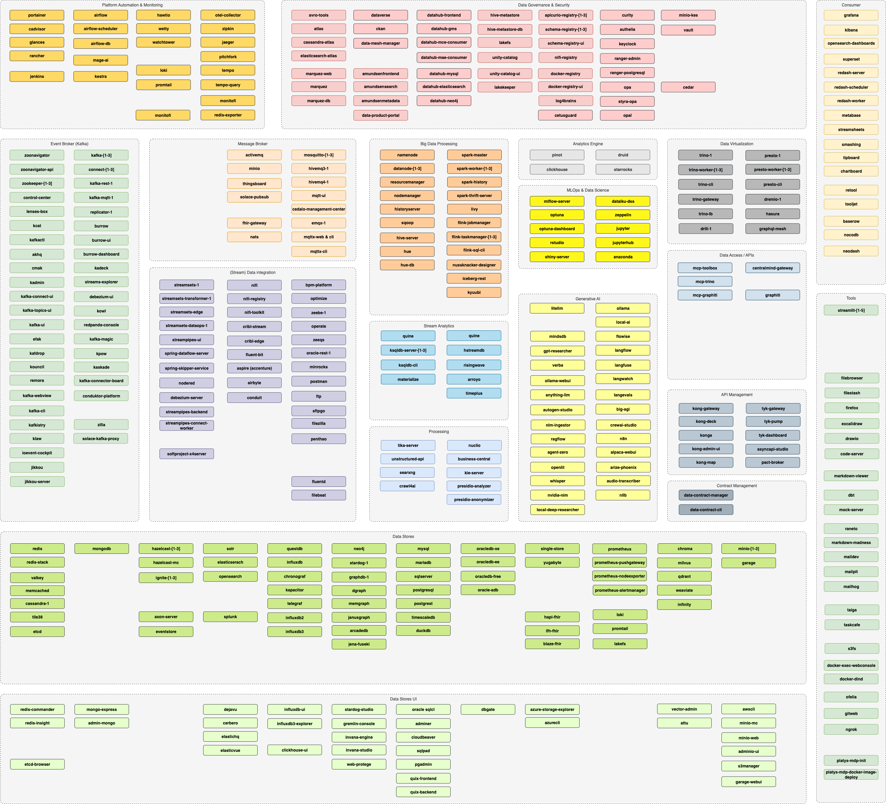

## Platform Stack: `modern-data-platform` - v1.18.1

This platform stack outlines the services included in a Modern Data Platform, which can be generated using the [Platys](http://github.com/trivadispf/platys) platform generator. Ensure that the Platys CLI is [installed](https://github.com/TrivadisPF/platys/blob/master/documentation/install)  before proceeding.

### Which services can I use? 

The Modern Data Platform allows for the selective provisioning of the following services: 

For new services to be added, please either create an [GitHub issue](https://github.com/TrivadisPF/modern-data-analytics-stack/issues/new) or create a Pull Request.

### Changes 
See [What's new?](./documentation/changes) for a detailed list of changes.

### Documentation

* [Getting Started with `platys` and `modern-data-platform` stack](./documentation/getting-started)
* [Configuration](./documentation/configuration) - all settings configurable in the `config.yml`
* [Tutorials](./tutorials/README) - various tutorials detailed instructions on how to work with `platys`
* [Cookbooks](./cookbooks/README) - various recipes showing how to use specific features of `platys`
* [Port Mapping](./documentation/port-mapping) - a list of all the ports which are mapped to the outside for the various supported services
* [Frequently Asked Questions](./documentation/faq)
* [Troubleshooting](./documentation/troubleshooting)
* [Adding additional services not supported by a platform stack](./documentation/docker-compose-override)
* [Creating a new stack in a scripted way](./documentation/start-stack-scripted-way)
* [How to use a platys-generated stack without Internet](https://github.com/TrivadisPF/platys/blob/master/documentation/docker-compose-without-internet)
* [Upgrade to a new platform stack version](https://github.com/TrivadisPF/platys/blob/master/documentation/upgrade-platform-stack)