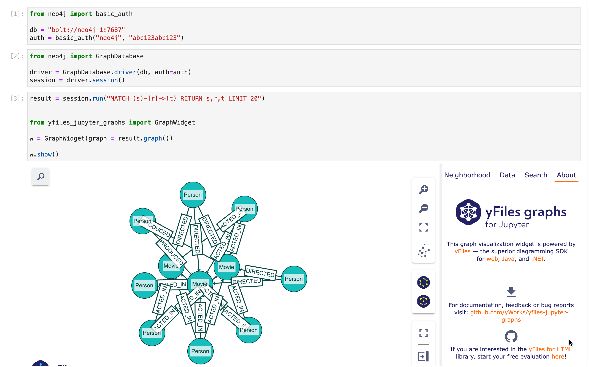

# Neo4J and yFiles graphs for Jupyter

This recipe will show how to use a Neo4j with the [jFiles Graph for Jupyter](https://www.yworks.com/products/yfiles-graphs-for-jupyter) to visualize graph networks with Python.

## Initialise data platform

First [initialise a platys-supported data platform](../documentation/getting-started) with the following services enabled

```
platys init --enable-services NEO4J,JUPYTER -s trivadis/platys-modern-data-platform -w 1.16.0
```

Before we can generate the platform, we need to extend the `config.yml`:

Add the required python modules to `JUPYTER_python_packages`

```yaml
      JUPYTER_python_packages: 'yfiles_jupyter_graphs neo4j ipywidgets'
```

and also add a custom token

```yaml
      JUPYTER_token: 'abc123!'
```

Now set an environment variable to the home folder of the dataplatform and generate and then start the data platform.

```bash
export DATAPLATFORM_HOME=${PWD}

platys gen

docker-compose up -d
```

## Load a database into Neo4J

Navigate to <http://:7474> and login as user `neo4j` and password `abc123abc123`.

Now load the movie graph by executing

```
:PLAY movie graph
```

on the resulting cell, navigate to page **2/8** and click on the play icon in the Cypher statement to execute it. 


The movie database is loaded into Neo4j.

## Using yFiles Graph from Jupyter

Navigate to <http://:28888> and login with the token specified above, i.e. `abc123!`.

Create a new notebook and add and execute the following cells:


First let's specify the login config

```cypher
from neo4j import basic_auth

db = "bolt://neo4j-1:7687"
auth = basic_auth("neo4j", "abc123abc123")
```

Now connect to the database

```cypher
from neo4j import GraphDatabase

driver = GraphDatabase.driver(db, auth=auth)
session = driver.session()
```

And execute a query against the database and visualize it


```cypher
result = session.run("MATCH (s)-[r]->(t) RETURN s,r,t LIMIT 20")


from yfiles_jupyter_graphs import GraphWidget

w = GraphWidget(graph = result.graph())

w.show()
```

you should see the following output in Jupyter

